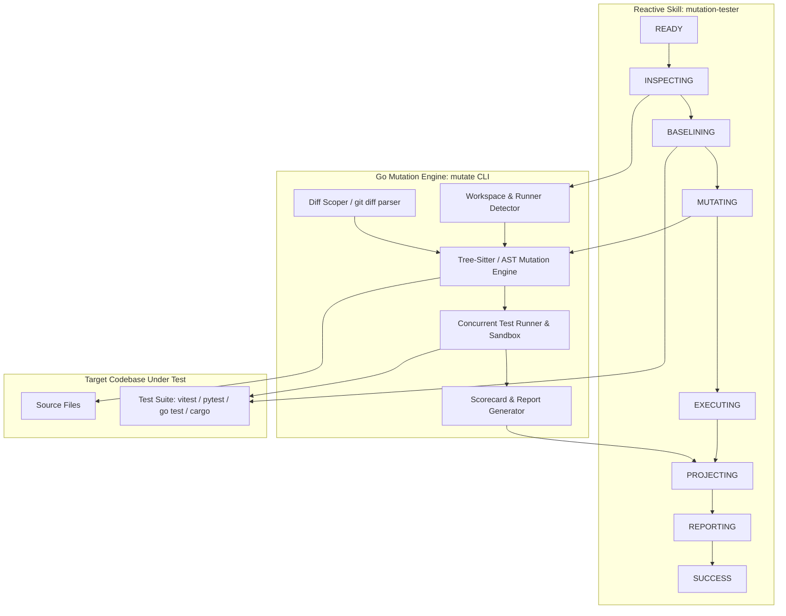

# System Design: Mutation Tester Reactive Skill & Go Engine

## 1. System Topology



## 2. Eventline / Event Modeling Sequence

```
[Command] InitializeMutationSession
  -> (Event) mutation-session-initialized

[Command] DetectWorkspaceAndRunner
  -> (Event) target-codebase-detected
  -> (Event) runner-config-resolved

[Command] VerifyBaselineTests
  -> (Event) baseline-suite-passed (or baseline-suite-failed)

[Command] SynthesizeMutants
  -> (Event) source-file-parsed
  -> (Event) mutant-candidate-synthesized
  -> (Event) differential-filter-applied

[Command] ExecuteMutantsConcurrently
  -> (Event) mutant-execution-scheduled
  -> (Event) mutant-execution-completed
  -> (Event) mutant-kill-confirmed | mutant-survival-detected | mutant-timeout-exceeded | mutant-build-errored

[Command] ProjectScorecard
  -> (Event) scorecard-metrics-computed
  -> (Event) mutation-report-projected
```

## 3. Technology Choices

- **Go Mutation Engine**: Single compiled binary (`mutate`) with fast startup, multi-core worker concurrency, and zero external runtime dependencies.
- **AST / Mutation Strategy**: Fast AST mutator supporting core operators:
  - `EqualityOperator`: `==` <-> `!=`, `===` <-> `!==`
  - `RelationalBoundary`: `<` <-> `<=`, `>` <-> `>=`
  - `ArithmeticSwap`: `+` <-> `-`, `*` <-> `/`
  - `LogicalInvert`: `&&` <-> `||`
  - `ConditionalInvert`: `if (x)` -> `if (!x)`
  - `ReturnSubstitution`: `return true` -> `return false`, `return err` -> `return nil`, `return 0` -> `return 1`
- **Differential Filter**: Resolves `git diff HEAD` (or staged/unstaged) line ranges to only introduce mutations within modified code.
- **Reactive Skill Integration**: Defined via `skill.yaml` (v2.2.0) and managed by `skill-manager`.
