# Reactive Skill Candidates — Mermaid State Diagrams

## 1. codebase-onboarding

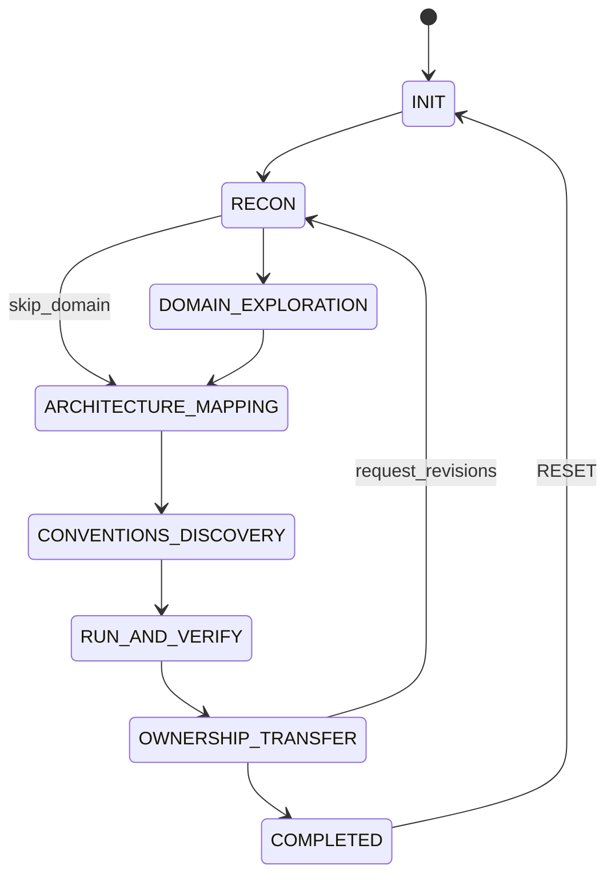

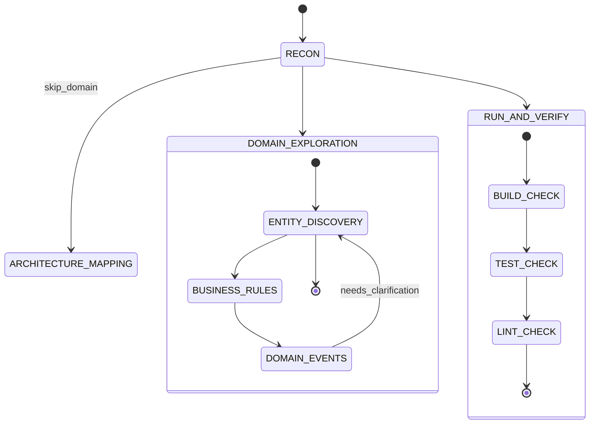

## 2. dependency-upgrade-agent

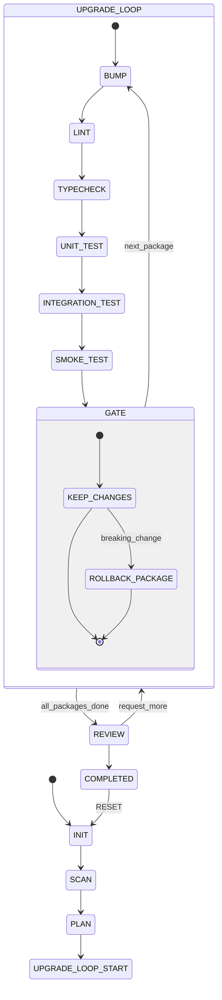

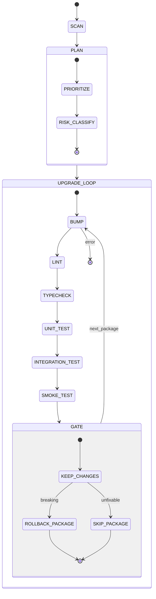

## 3. performance-budget-enforcer

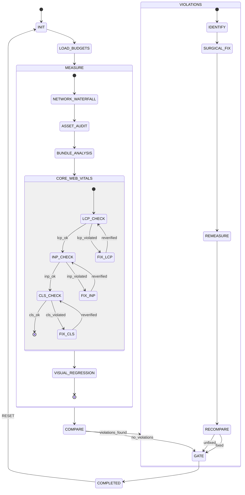

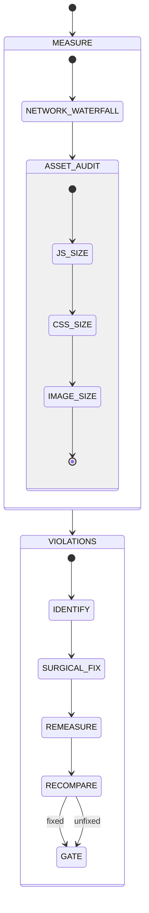

## 4. api-contract-validator

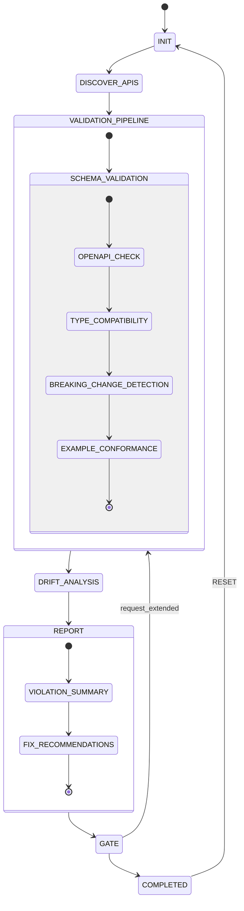

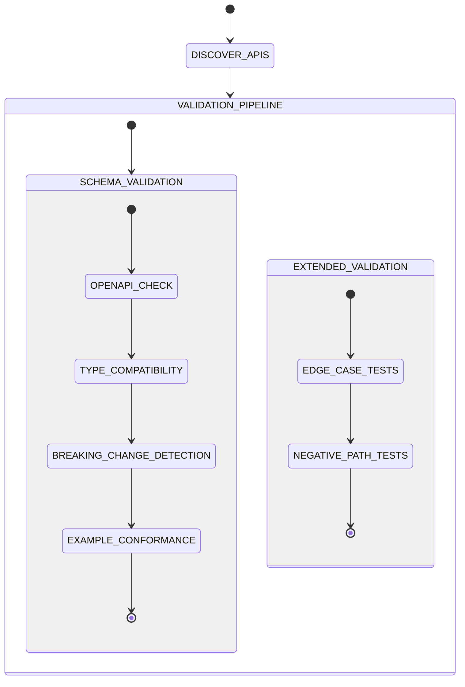

## 5. database-migration-safety

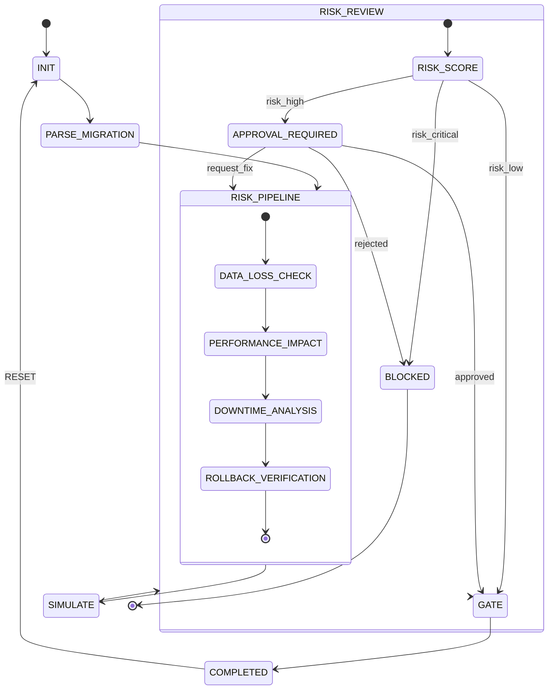

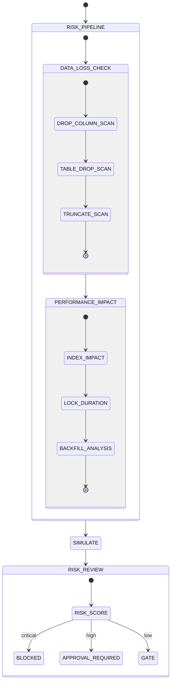

## 7. browser-verifier

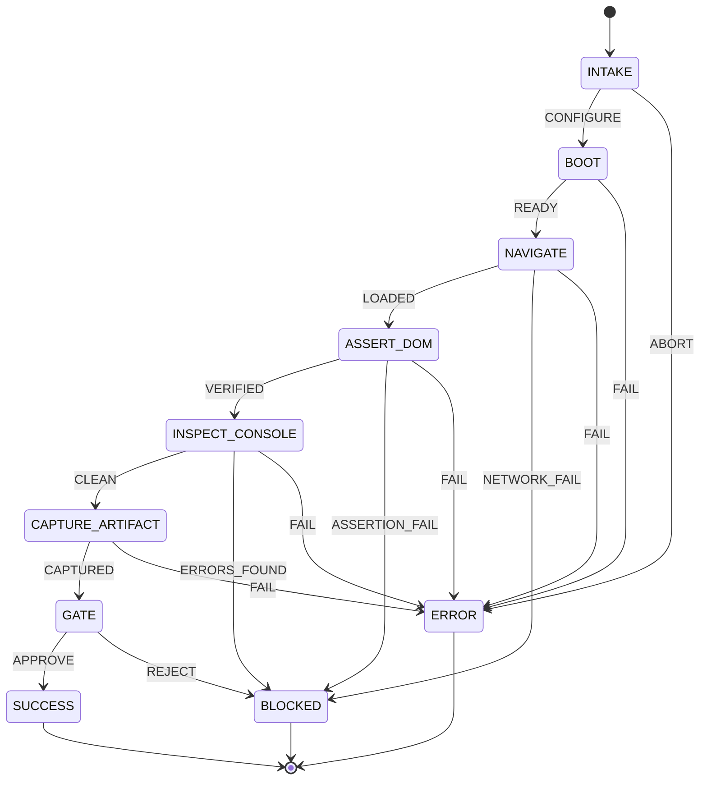

## 8. ci-cd-automation

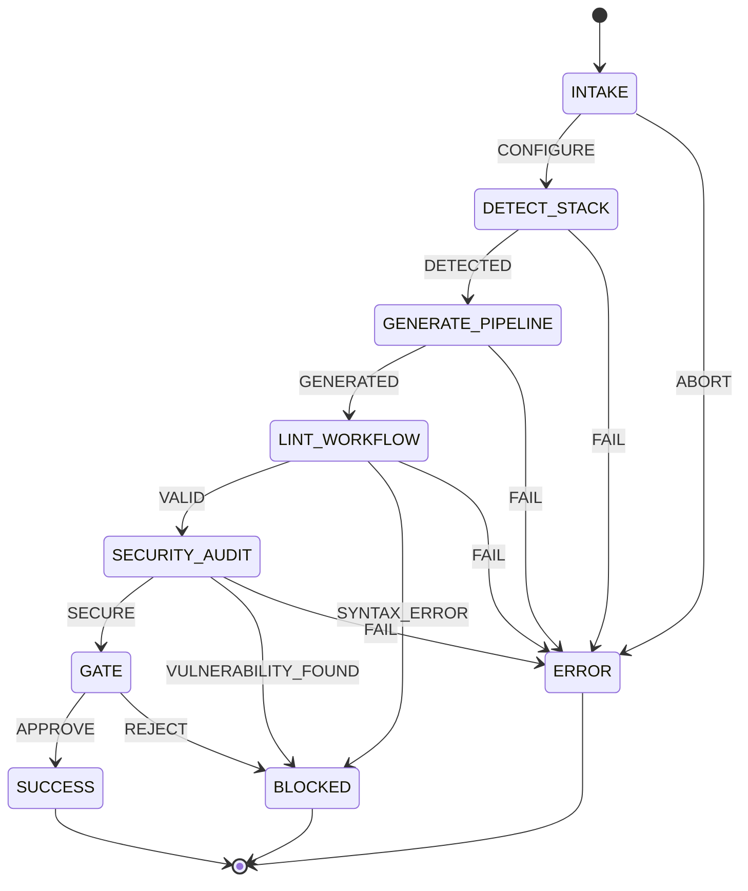
