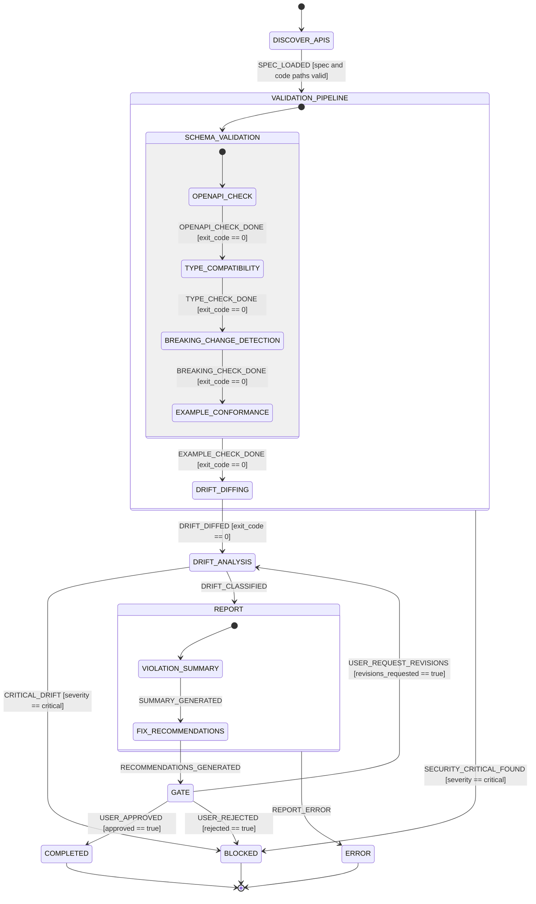

# STATECHART - api-contract

## Bubble-Up Transitions

1. **`SECURITY_CRITICAL_FOUND`** (from any substate of VALIDATION_PIPELINE): Guards with `event.payload.severity === 'critical'`, transitions to `BLOCKED`. This catches security issues (e.g., credentials in spec, exposed endpoints) without requiring each leaf state to explicitly handle them.

2. **`CRITICAL_DRIFT`** (from DRIFT_ANALYSIS): Guards with `event.payload.severity === 'critical'`, transitions to `BLOCKED`. Catches drift findings severe enough to halt the pipeline.

3. **`REPORT_ERROR`** (from any substate of REPORT): Transitions to `ERROR` terminal state without a guard, for unrecoverable report generation failures.

## Gate Semantics

The `GATE` state is the sole Human-in-the-Loop (HITL) checkpoint. The user can:
- **Approve & Complete** → `COMPLETED` (guard: `approved === true`)
- **Request Revisions** → `DRIFT_ANALYSIS` (guard: `revisions_requested === true`) - sends the workflow back to the analysis phase
- **Reject (Block)** → `BLOCKED` (guard: `rejected === true`) - halts with critical violations

## Event Sourcing

All signals, guard evaluations, and state transitions are appended to:
- `.reactive/skills/api-contract/events.jsonl` (human-readable)
- `.reactive/skills/api-contract/events.db` (SQLite queries)

Deliverable projections are triggered on `STATE_TRANSITION` and `SIGNAL_EMITTED` events, rendering from Handlebars templates in `templates/`.
