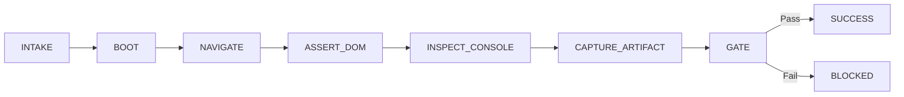

# 🌐 Browser Verifier

> Automated browser verification reactive skill that launches headless browser sessions, verifies DOM states, intercepts console errors, and captures visual artifacts.

---

## Overview

`browser-verifier` executes end-to-end browser testing as an event-driven state machine. It prevents broken UI, layout regressions, and runtime JavaScript exceptions from shipping to production.

## Features

- **Headless Browser Execution**: Supports Chromium, Firefox, and WebKit via Playwright or Chrome DevTools.
- **Console & Network Interception**: Zero-tolerance policy for `console.error` and unhandled promise rejections.
- **Semantic DOM Assertions**: Validates accessibility landmarks, headings, text content, and interactive states.
- **Evidence Capture**: Automatically captures full-page visual screenshots and serialized DOM trees.

## Quick Start

```bash
# Execute browser verification against local dev server
npx -y @reactive-skills/axi invoke browser-verifier --payload '{
  "target_url": "http://localhost:3000",
  "assertion_rules": [
    { "selector": "[data-testid=\"app-shell\"]", "expected": "visible" }
  ]
}'
```

## Workflow Lifecycle


