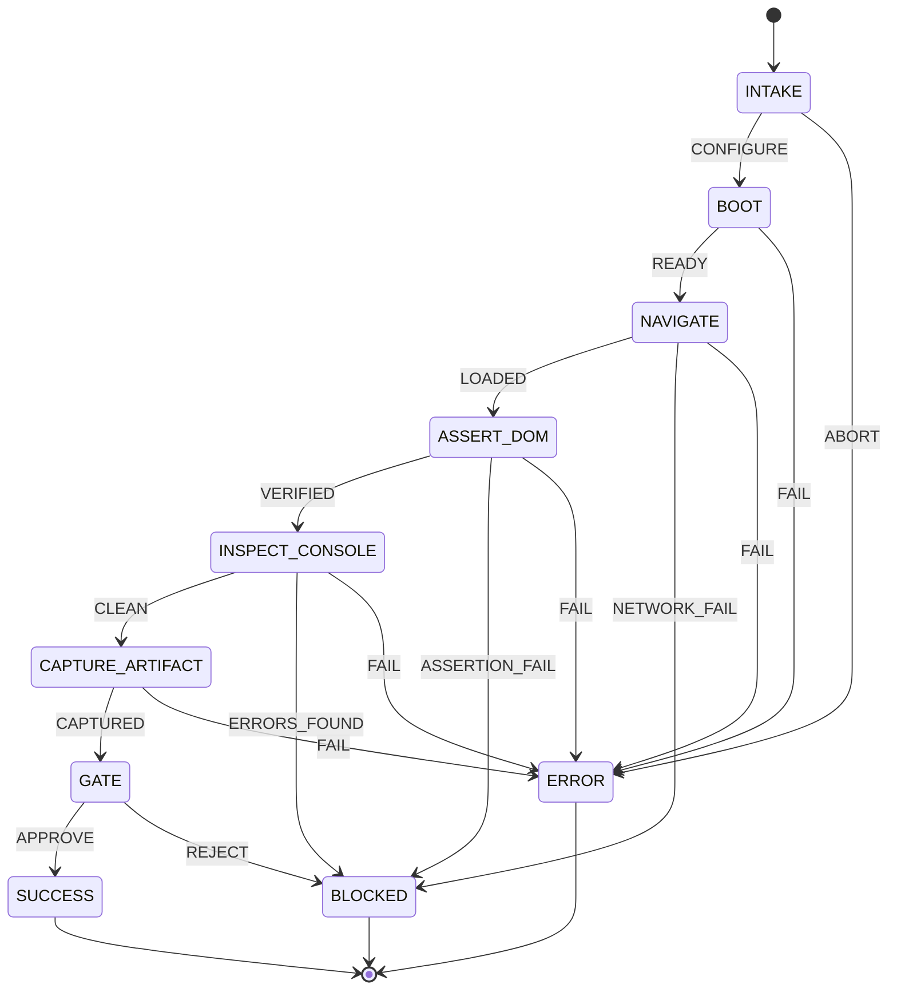

# Browser Verifier Statechart

```mermaid
stateDiagram-v2
    [*] --> INTAKE
    INTAKE --> BOOT: CONFIGURE
    INTAKE --> ERROR: ABORT

    BOOT --> NAVIGATE: READY
    BOOT --> ERROR: FAIL

    NAVIGATE --> ASSERT_DOM: LOADED
    NAVIGATE --> BLOCKED: NETWORK_FAIL
    NAVIGATE --> ERROR: FAIL

    ASSERT_DOM --> INSPECT_CONSOLE: VERIFIED
    ASSERT_DOM --> BLOCKED: ASSERTION_FAIL
    ASSERT_DOM --> ERROR: FAIL

    INSPECT_CONSOLE --> CAPTURE_ARTIFACT: CLEAN
    INSPECT_CONSOLE --> BLOCKED: ERRORS_FOUND
    INSPECT_CONSOLE --> ERROR: FAIL

    CAPTURE_ARTIFACT --> GATE: CAPTURED
    CAPTURE_ARTIFACT --> ERROR: FAIL

    GATE --> SUCCESS: APPROVE
    GATE --> BLOCKED: REJECT

    SUCCESS --> [*]
    BLOCKED --> [*]
    ERROR --> [*]
```
