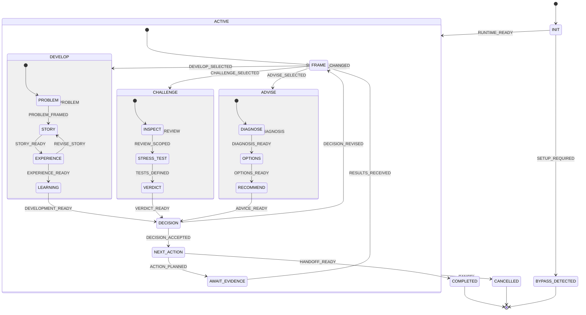

# build-advisor statechart

Generated from the current manifest by the authoring check.

Parent transitions handle unhandled signals from every descendant.
A waiting run resumes at its persisted leaf; no unsupported history pseudo-state is required.

| From | Signal | To | Guard |
| --- | --- | --- | --- |
| INIT | RUNTIME_READY | ACTIVE | `payload.compatible === true && payload.contextUpdates?.selected_runtime?.compatible === true` |
| INIT | SETUP_REQUIRED | BYPASS_DETECTED | `payload.compatible === false` |
| ACTIVE | ROUTE_CHANGED | ACTIVE.FRAME | `["develop","challenge","advise"].includes(payload.contextUpdates?.route) && typeof payload.reason === "string" && payload.reason.trim().length > 0` |
| ACTIVE | SITUATION_CHANGED | ACTIVE.FRAME | `Number.isInteger(payload.contextUpdates?.basis_version) && payload.contextUpdates.basis_version === context.basis_version + 1 && typeof payload.reason === "string" && payload.reason.trim().length > 0` |
| ACTIVE | CANCEL | CANCELLED | `typeof payload.reason === "string" && payload.reason.trim().length > 0` |
| ACTIVE.FRAME | DEVELOP_SELECTED | ACTIVE.DEVELOP | `payload.contextUpdates?.route === "develop" && payload.contextUpdates?.situation != null && typeof payload.contextUpdates.situation.question === "string" && payload.contextUpdates.situation.question.trim().length > 0 && ["product","leadership","business","team","career"].includes(payload.contextUpdates.situation.domain) && typeof payload.contextUpdates.situation.stage === "string" && payload.contextUpdates.situation.stage.trim().length > 0 && typeof payload.contextUpdates.situation.decision_owner === "string" && payload.contextUpdates.situation.decision_owner.trim().length > 0 && Array.isArray(payload.contextUpdates.situation.constraints) && Array.isArray(payload.contextUpdates.evidence) && payload.contextUpdates.evidence.every(e => e && typeof e.id === "string" && e.id.trim().length > 0 && typeof e.claim === "string" && e.claim.trim().length > 0 && ["observed","interpretation","assumption","conviction"].includes(e.kind) && typeof e.source === "string" && e.source.trim().length > 0)` |
| ACTIVE.FRAME | CHALLENGE_SELECTED | ACTIVE.CHALLENGE | `payload.contextUpdates?.route === "challenge" && payload.contextUpdates?.situation != null && typeof payload.contextUpdates.situation.question === "string" && payload.contextUpdates.situation.question.trim().length > 0 && ["product","leadership","business","team","career"].includes(payload.contextUpdates.situation.domain) && typeof payload.contextUpdates.situation.stage === "string" && payload.contextUpdates.situation.stage.trim().length > 0 && typeof payload.contextUpdates.situation.decision_owner === "string" && payload.contextUpdates.situation.decision_owner.trim().length > 0 && Array.isArray(payload.contextUpdates.situation.constraints) && Array.isArray(payload.contextUpdates.evidence) && payload.contextUpdates.evidence.every(e => e && typeof e.id === "string" && e.id.trim().length > 0 && typeof e.claim === "string" && e.claim.trim().length > 0 && ["observed","interpretation","assumption","conviction"].includes(e.kind) && typeof e.source === "string" && e.source.trim().length > 0)` |
| ACTIVE.FRAME | ADVISE_SELECTED | ACTIVE.ADVISE | `payload.contextUpdates?.route === "advise" && payload.contextUpdates?.situation != null && typeof payload.contextUpdates.situation.question === "string" && payload.contextUpdates.situation.question.trim().length > 0 && ["product","leadership","business","team","career"].includes(payload.contextUpdates.situation.domain) && typeof payload.contextUpdates.situation.stage === "string" && payload.contextUpdates.situation.stage.trim().length > 0 && typeof payload.contextUpdates.situation.decision_owner === "string" && payload.contextUpdates.situation.decision_owner.trim().length > 0 && Array.isArray(payload.contextUpdates.situation.constraints) && Array.isArray(payload.contextUpdates.evidence) && payload.contextUpdates.evidence.every(e => e && typeof e.id === "string" && e.id.trim().length > 0 && typeof e.claim === "string" && e.claim.trim().length > 0 && ["observed","interpretation","assumption","conviction"].includes(e.kind) && typeof e.source === "string" && e.source.trim().length > 0)` |
| ACTIVE.DEVELOP | REVISE_PROBLEM | ACTIVE.DEVELOP.PROBLEM | `typeof payload.reason === "string" && payload.reason.trim().length > 0` |
| ACTIVE.DEVELOP.PROBLEM | PROBLEM_FRAMED | ACTIVE.DEVELOP.STORY | `payload.contextUpdates?.problem?.basis_version === context.basis_version && typeof payload.contextUpdates.problem.customer === "string" && payload.contextUpdates.problem.customer.trim().length > 0 && typeof payload.contextUpdates.problem.pain === "string" && payload.contextUpdates.problem.pain.trim().length > 0 && typeof payload.contextUpdates.problem.why_now === "string" && payload.contextUpdates.problem.why_now.trim().length > 0 && Array.isArray(payload.contextUpdates.problem.alternatives) && payload.contextUpdates.problem.alternatives.length > 0` |
| ACTIVE.DEVELOP.STORY | STORY_READY | ACTIVE.DEVELOP.EXPERIENCE | `payload.contextUpdates?.story?.basis_version === context.basis_version && typeof payload.contextUpdates.story.narrative === "string" && payload.contextUpdates.story.narrative.trim().length > 0 && typeof payload.contextUpdates.story.promise === "string" && payload.contextUpdates.story.promise.trim().length > 0 && Array.isArray(payload.contextUpdates.story.claims)` |
| ACTIVE.DEVELOP.EXPERIENCE | EXPERIENCE_READY | ACTIVE.DEVELOP.LEARNING | `payload.contextUpdates?.experience?.basis_version === context.basis_version && Array.isArray(payload.contextUpdates.experience.touchpoints) && ["discovery","evaluation","acquisition","onboarding","use","support","retention","exit"].every(stage => payload.contextUpdates.experience.touchpoints.some(t => t?.stage === stage && ["mapped","needs_test","not_applicable"].includes(t.status) && typeof t.detail === "string" && t.detail.trim().length > 0))` |
| ACTIVE.DEVELOP.EXPERIENCE | REVISE_STORY | ACTIVE.DEVELOP.STORY | `typeof payload.reason === "string" && payload.reason.trim().length > 0` |
| ACTIVE.DEVELOP.LEARNING | DEVELOPMENT_READY | ACTIVE.DECISION | `payload.contextUpdates?.learning_plan?.basis_version === context.basis_version && Array.isArray(payload.contextUpdates.learning_plan.experiments) && Array.isArray(payload.contextUpdates.learning_plan.milestones) && payload.contextUpdates.learning_plan.milestones.length > 0 && typeof payload.contextUpdates.learning_plan.launch_criteria === "string" && payload.contextUpdates.learning_plan.launch_criteria.trim().length > 0 && typeof payload.contextUpdates.learning_plan.next_generation === "string" && payload.contextUpdates.learning_plan.next_generation.trim().length > 0 && payload.contextUpdates?.recommendation?.basis_version === context.basis_version && payload.contextUpdates.recommendation.route === context.route && ["proceed","revise","investigate","defer","stop"].includes(payload.contextUpdates.recommendation.direction) && typeof payload.contextUpdates.recommendation.rationale === "string" && payload.contextUpdates.recommendation.rationale.trim().length > 0 && Array.isArray(payload.contextUpdates.recommendation.limitations)` |
| ACTIVE.CHALLENGE | REVISE_REVIEW | ACTIVE.CHALLENGE.INSPECT | `typeof payload.reason === "string" && payload.reason.trim().length > 0` |
| ACTIVE.CHALLENGE.INSPECT | REVIEW_SCOPED | ACTIVE.CHALLENGE.STRESS_TEST | `payload.contextUpdates?.assessment?.basis_version === context.basis_version && typeof payload.contextUpdates.assessment.artifact === "string" && payload.contextUpdates.assessment.artifact.trim().length > 0 && typeof payload.contextUpdates.assessment.summary === "string" && payload.contextUpdates.assessment.summary.trim().length > 0 && Array.isArray(payload.contextUpdates.assessment.findings)` |
| ACTIVE.CHALLENGE.STRESS_TEST | TESTS_DEFINED | ACTIVE.CHALLENGE.VERDICT | `payload.contextUpdates?.uncertainty_plan?.basis_version === context.basis_version && Array.isArray(payload.contextUpdates.uncertainty_plan.tests) && (payload.contextUpdates.uncertainty_plan.tests.length > 0 &#124;&#124; (typeof payload.contextUpdates.uncertainty_plan.no_test_reason === "string" && payload.contextUpdates.uncertainty_plan.no_test_reason.trim().length > 0)) && payload.contextUpdates.uncertainty_plan.tests.every(t => t && typeof t.question === "string" && t.question.trim().length > 0 && typeof t.method === "string" && t.method.trim().length > 0 && typeof t.measure === "string" && t.measure.trim().length > 0 && typeof t.deadline === "string" && t.deadline.trim().length > 0 && ["planned","observed"].includes(t.status) && Array.isArray(t.evidence_refs) && (t.status === "planned" &#124;&#124; (t.evidence_refs.length > 0 && t.evidence_refs.every(id => context.evidence.some(e => e.id === id && e.kind === "observed")))))` |
| ACTIVE.CHALLENGE.VERDICT | VERDICT_READY | ACTIVE.DECISION | `payload.contextUpdates?.recommendation?.basis_version === context.basis_version && payload.contextUpdates.recommendation.route === context.route && ["proceed","revise","investigate","defer","stop"].includes(payload.contextUpdates.recommendation.direction) && typeof payload.contextUpdates.recommendation.rationale === "string" && payload.contextUpdates.recommendation.rationale.trim().length > 0 && Array.isArray(payload.contextUpdates.recommendation.limitations)` |
| ACTIVE.ADVISE | REVISE_DIAGNOSIS | ACTIVE.ADVISE.DIAGNOSE | `typeof payload.reason === "string" && payload.reason.trim().length > 0` |
| ACTIVE.ADVISE.DIAGNOSE | DIAGNOSIS_READY | ACTIVE.ADVISE.OPTIONS | `payload.contextUpdates?.diagnosis?.basis_version === context.basis_version && typeof payload.contextUpdates.diagnosis.issue === "string" && payload.contextUpdates.diagnosis.issue.trim().length > 0 && typeof payload.contextUpdates.diagnosis.decision_type === "string" && payload.contextUpdates.diagnosis.decision_type.trim().length > 0 && Array.isArray(payload.contextUpdates.diagnosis.principles) && payload.contextUpdates.diagnosis.principles.length > 0` |
| ACTIVE.ADVISE.OPTIONS | OPTIONS_READY | ACTIVE.ADVISE.RECOMMEND | `payload.contextUpdates?.options?.basis_version === context.basis_version && Array.isArray(payload.contextUpdates.options.choices) && payload.contextUpdates.options.choices.length >= 2 && payload.contextUpdates.options.choices.every(o => o && typeof o.choice === "string" && o.choice.trim().length > 0 && typeof o.consequences === "string" && o.consequences.trim().length > 0)` |
| ACTIVE.ADVISE.RECOMMEND | ADVICE_READY | ACTIVE.DECISION | `payload.contextUpdates?.recommendation?.basis_version === context.basis_version && payload.contextUpdates.recommendation.route === context.route && ["proceed","revise","investigate","defer","stop"].includes(payload.contextUpdates.recommendation.direction) && typeof payload.contextUpdates.recommendation.rationale === "string" && payload.contextUpdates.recommendation.rationale.trim().length > 0 && Array.isArray(payload.contextUpdates.recommendation.limitations)` |
| ACTIVE.DECISION | DECISION_ACCEPTED | ACTIVE.NEXT_ACTION | `payload.approved === true && typeof payload.approval_source === "string" && payload.approval_source.trim().length > 0 && payload.contextUpdates?.decision?.basis_version === context.basis_version && context.recommendation?.basis_version === context.basis_version && context.recommendation?.route === context.route && ["proceed","revise","investigate","defer","stop"].includes(payload.contextUpdates.decision.direction) && typeof payload.contextUpdates.decision.rationale === "string" && payload.contextUpdates.decision.rationale.trim().length > 0 && typeof payload.contextUpdates.decision.owner === "string" && payload.contextUpdates.decision.owner.trim().length > 0` |
| ACTIVE.DECISION | DECISION_REVISED | ACTIVE.FRAME | `typeof payload.feedback === "string" && payload.feedback.trim().length > 0` |
| ACTIVE.NEXT_ACTION | ACTION_PLANNED | ACTIVE.AWAIT_EVIDENCE | `payload.contextUpdates?.action?.basis_version === context.basis_version && typeof payload.contextUpdates.action.owner === "string" && payload.contextUpdates.action.owner.trim().length > 0 && typeof payload.contextUpdates.action.next_step === "string" && payload.contextUpdates.action.next_step.trim().length > 0 && typeof payload.contextUpdates.action.review_trigger === "string" && payload.contextUpdates.action.review_trigger.trim().length > 0 && context.decision?.basis_version === context.basis_version && ["experiment","review"].includes(payload.contextUpdates.action.type)` |
| ACTIVE.NEXT_ACTION | HANDOFF_READY | COMPLETED | `payload.contextUpdates?.action?.basis_version === context.basis_version && typeof payload.contextUpdates.action.owner === "string" && payload.contextUpdates.action.owner.trim().length > 0 && typeof payload.contextUpdates.action.next_step === "string" && payload.contextUpdates.action.next_step.trim().length > 0 && typeof payload.contextUpdates.action.review_trigger === "string" && payload.contextUpdates.action.review_trigger.trim().length > 0 && context.decision?.basis_version === context.basis_version && ["handoff","stop"].includes(payload.contextUpdates.action.type) && payload.handoff_delivered === true` |
| ACTIVE.AWAIT_EVIDENCE | RESULTS_RECEIVED | ACTIVE.FRAME | `Number.isInteger(payload.contextUpdates?.basis_version) && payload.contextUpdates.basis_version === context.basis_version + 1 && Array.isArray(payload.contextUpdates.evidence) && Array.isArray(payload.result_refs) && payload.result_refs.length > 0 && payload.result_refs.every(id => payload.contextUpdates.evidence.some(e => e?.id === id && e.kind === "observed" && typeof e.claim === "string" && e.claim.trim().length > 0 && typeof e.source === "string" && e.source.trim().length > 0) && !context.evidence.some(e => e.id === id))` |
