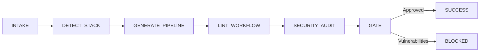

# 🚀 CI/CD Automation

> Automated CI/CD pipeline generator and linter that scaffolds production-ready workflows with caching, matrix builds, and security gates.

---

## Overview

`ci-cd-automation` generates resilient, secure continuous integration pipelines. It automatically identifies languages and package managers, wires multi-tier caching, and audits actions against common supply-chain vulnerabilities.

## Features

- **Multi-Provider Support**: GitHub Actions and GitLab CI support out of the box.
- **Automated Stack Detection**: Resolves Node (npm, pnpm, yarn), Go, Rust (cargo), Python (poetry, pip), and .NET.
- **Security-First Architecture**: Strictly enforces `permissions: contents: read` and audits action pins.
- **Intelligent Caching**: Automatically configures dependency cache keys based on lockfile hashes.

## Quick Start

```bash
npx -y @reactive-skills/axi invoke ci-cd-automation --payload '{
  "provider": "github-actions",
  "test_command": "npm test",
  "build_command": "npm run build"
}'
```

## Workflow Lifecycle


