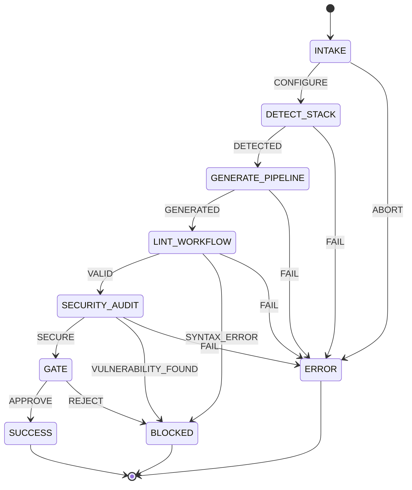

# CI/CD Automation Statechart

```mermaid
stateDiagram-v2
    [*] --> INTAKE
    INTAKE --> DETECT_STACK: CONFIGURE
    INTAKE --> ERROR: ABORT

    DETECT_STACK --> GENERATE_PIPELINE: DETECTED
    DETECT_STACK --> ERROR: FAIL

    GENERATE_PIPELINE --> LINT_WORKFLOW: GENERATED
    GENERATE_PIPELINE --> ERROR: FAIL

    LINT_WORKFLOW --> SECURITY_AUDIT: VALID
    LINT_WORKFLOW --> BLOCKED: SYNTAX_ERROR
    LINT_WORKFLOW --> ERROR: FAIL

    SECURITY_AUDIT --> GATE: SECURE
    SECURITY_AUDIT --> BLOCKED: VULNERABILITY_FOUND
    SECURITY_AUDIT --> ERROR: FAIL

    GATE --> SUCCESS: APPROVE
    GATE --> BLOCKED: REJECT

    SUCCESS --> [*]
    BLOCKED --> [*]
    ERROR --> [*]
```
