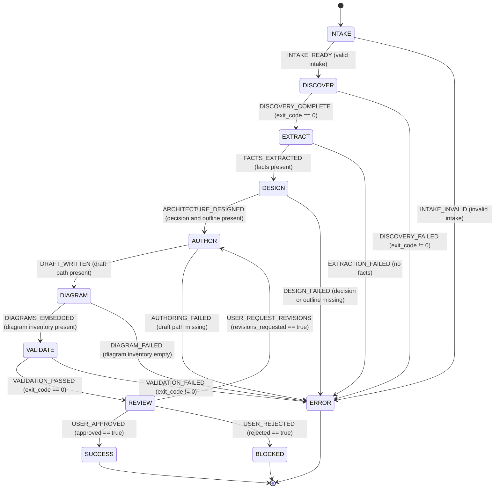

# Docs Architect - Statechart

## Transition Guard Reference

| From | Signal | To | Guard |
|---|---|---|---|
| `INTAKE` | `INTAKE_READY` | `DISCOVER` | source paths, audience, and outcomes are valid |
| `INTAKE` | `INTAKE_INVALID` | `ERROR` | intake is invalid |
| `DISCOVER` | `DISCOVERY_COMPLETE` | `EXTRACT` | `payload.exit_code === 0` |
| `DISCOVER` | `DISCOVERY_FAILED` | `ERROR` | `payload.exit_code !== 0` |
| `EXTRACT` | `FACTS_EXTRACTED` | `DESIGN` | extracted facts are non-empty |
| `EXTRACT` | `EXTRACTION_FAILED` | `ERROR` | extracted facts are absent |
| `DESIGN` | `ARCHITECTURE_DESIGNED` | `AUTHOR` | decision and outline are present |
| `DESIGN` | `DESIGN_FAILED` | `ERROR` | decision or outline is missing |
| `AUTHOR` | `DRAFT_WRITTEN` | `DIAGRAM` | draft path is present |
| `AUTHOR` | `AUTHORING_FAILED` | `ERROR` | draft path is missing |
| `DIAGRAM` | `DIAGRAMS_EMBEDDED` | `VALIDATE` | diagram inventory is non-empty |
| `DIAGRAM` | `DIAGRAM_FAILED` | `ERROR` | diagram inventory is empty |
| `VALIDATE` | `VALIDATION_PASSED` | `REVIEW` | `payload.validation_exit_code === 0` |
| `VALIDATE` | `VALIDATION_FAILED` | `ERROR` | validation exit code is non-zero |
| `REVIEW` | `USER_APPROVED` | `SUCCESS` | `payload.approved === true` |
| `REVIEW` | `USER_REQUEST_REVISIONS` | `AUTHOR` | `payload.revisions_requested === true` |
| `REVIEW` | `USER_REJECTED` | `BLOCKED` | `payload.rejected === true` |

`SUCCESS`, `BLOCKED`, and `ERROR` are terminal states.
