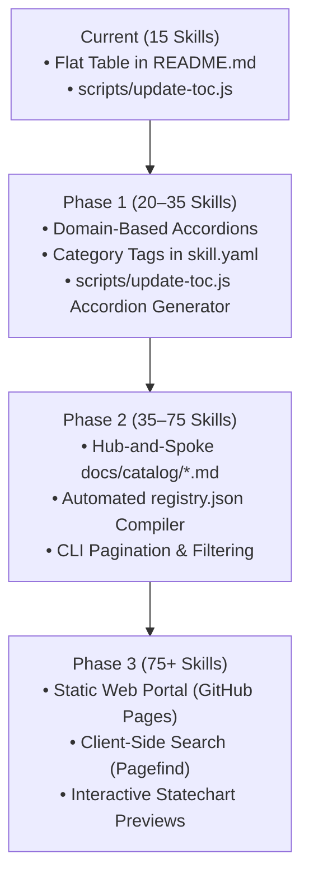

# 🗺️ Reactive Skills Registry: Scaling & Catalog Pagination Roadmap

> **Status:** Proposed / Future Architecture  
> **Target:** Reactive Skills Registry (`Reactive-Skills/skills`)  
> **Related Cortex Note:** `99d4b6a8-d7a1-4292-ac73-0fc9f68aff90`

---

## 📌 Context & Motivation

The **Reactive Skills Registry** currently houses 15 verified reactive skills. All skills are listed in a single, auto-generated Table of Contents in the root [`README.md`](../README.md) via `scripts/update-toc.js`.

As the registry expands toward 30, 50, and 100+ skills:
1. **Human Usability (Scroll Fatigue)**: A flat table exceeding 25 rows degrades readability, makes domain-based exploration tedious, and increases initial page render latency on GitHub.
2. **AI Agent Context Inefficiency**: Agents ingesting the repository root to discover relevant capabilities waste significant prompt tokens parsing an unbounded Markdown table rather than discovering focused domain tools.
3. **Discovery & Search**: Simple numerical pagination (e.g. `Page 1`, `Page 2`) impairs discovery because related tools become arbitrarily split across pages.

This document establishes the architecture and execution roadmap for scaling catalog organization, agent-native discovery, and future portal infrastructure.

---

## 🧭 Design Principles

- **Domain Affinity over Numerical Slicing**: Skills should be discovered by functional domain (e.g. *SDLC*, *Testing & QA*, *DevOps & Security*, *Career & Operations*), not arbitrary alphabetical or numeric splits.
- **Zero Token Waste for Agents**: Autonomous agents must be able to query, filter, and inspect skills via compact JSON indices and CLI commands without loading entire catalogs into context.
- **Automated Single-Source-of-Truth**: All catalog views (Markdown tables, JSON indices, web portal pages) must be derived deterministically from the authoritative manifests (`skill.yaml` and `skill-release.json`).
- **Backward Compatibility**: `npx skills add Reactive-Skills/skills --skill <name>` and `reactive-skills-axi state <name>` must continue to work without path disruption.

---

## 🚀 Phased Scaling Roadmap



---

### Phase 1: Domain-Based Collapsible Accordions (20–35 Skills)

**Goal**: Eliminate vertical scroll fatigue while keeping the catalog directly visible in the root [`README.md`](../README.md).

#### Implementation Details:
1. **Manifest Category Field**: Add a `category` key to each `skill.yaml`:
   ```yaml
   category: sdlc # Options: sdlc, testing, devops, career, architecture, docs
   ```
2. **Accordion Generation**: Update `scripts/update-toc.js` to group skills by category using native GitHub Markdown `<details>` and `<summary>` tags:
   ```markdown
   ### 🔄 SDLC & Engineering Workflow
   <details open>
   <summary>View SDLC Skills (4)</summary>

   | Skill | Version | Schema | Description |
   | :--- | :--- | :--- | :--- |
   | [`jsm-workflow`](jsm-workflow/) | `v1.0.0` | `v2.1.0` | Reactive SDLC coordinator... |
   </details>

   ### 🧪 Testing, Quality & Verification
   <details>
   <summary>View Testing Skills (5)</summary>
   ...
   </details>
   ```
3. **Benefits**: Keeps the entire catalog on the homepage without taking up 100+ vertical lines of space.

---

### Phase 2: Hub-and-Spoke Catalog & Machine-Readable Index (35–75 Skills)

**Goal**: Decouple the homepage from complete catalog listings and provide token-efficient discovery for agents.

#### Implementation Details:
1. **Lean Root Showcase**:
   - The root [`README.md`](../README.md) is trimmed to highlight only **Featured Flagship Skills** (e.g. `jsm-workflow`, `mutation-tester`, `resume-manager`, `skill-manager`).
   - Links directly to dedicated domain catalog files:
     - `docs/catalog/sdlc.md`
     - `docs/catalog/testing-qa.md`
     - `docs/catalog/devops-security.md`
     - `docs/catalog/career-operations.md`
2. **Machine-Readable Registry Index (`registry.json`)**:
   - Script `scripts/build-registry.js` outputs a root-level `registry.json` containing metadata, categories, tags, state counts, and dependency versions:
     ```json
     {
       "$schema": "./schemas/registry.schema.json",
       "total_skills": 42,
       "updated_at": "2026-09-20T18:00:00Z",
       "categories": ["sdlc", "testing", "devops", "career"],
       "skills": [
         {
           "name": "jsm-workflow",
           "version": "1.0.0",
           "category": "sdlc",
           "description": "Reactive SDLC coordinator...",
           "states_count": 16,
           "path": "jsm-workflow"
         }
       ]
     }
     ```
3. **Agent & CLI Pagination**:
   - Updates to `@reactive-skills/axi` to read `registry.json` directly for paged discovery:
     ```bash
     # Developer or AI agent commands:
     reactive-skills-axi catalog --page 1 --limit 10
     reactive-skills-axi catalog --category testing
     reactive-skills-axi catalog search "review"
     ```

---

### Phase 3: Searchable Static Web Portal (75+ Skills)

**Goal**: Full-featured interactive package portal hosted on GitHub Pages (e.g. `skills.reactive-skills.org` or `reactive-skills.github.io/skills`).

#### Implementation Details:
1. **Engine**: [Astro Starlight](https://starlight.astro.build/) or [VitePress](https://vitepress.dev/) configured in `.github/workflows/deploy-portal.yml`.
2. **Client-Side Search**: Built-in indexing with [Pagefind](https://pagefind.app/) (sub-second full-text search with zero backend dependencies).
3. **Faceted Filtering**: Filter by category, language support, reactive schema version (`v2.1.0`, `v2.2.0`), and strict execution flags.
4. **Rich Statechart Rendering**: Dynamic Mermaid diagrams with zoomable canvas for inspecting state machines directly in the browser.
5. **One-Click Installs**: Copy commands for `npx skills add` and AXI CLI invocation.

---

## 🏷️ Standard Domain Taxonomy

When categorizing skills across Phase 1 and Phase 2, use the following standardized taxonomy:

| Domain Key | Human Name | Scope / Examples |
| :--- | :--- | :--- |
| `sdlc` | **SDLC & Workflow** | End-to-end delivery coordinators (`jsm-workflow`), PR triage (`pr-triage`), release notes (`release-notes`). |
| `testing` | **Testing & Quality Assurance** | Mutation testing (`mutation-tester`), test coverage gating (`test-coverage-gate`), browser verification (`browser-verifier`), TDD refactoring (`tdd-refactor`). |
| `devops` | **DevOps, CI/CD & Security** | Pipeline automation (`ci-cd-automation`), pre-commit secret scanning (`security-scan`), API drift detection (`api-contract`). |
| `career` | **Career & Agent Operations** | Career history and profile tailoring (`resume-manager`), skill CRUD lifecycle manager (`skill-manager`). |
| `architecture` | **Architecture & Documentation** | Documentation authoring (`docs-architect`), codebase onboarding maps (`onboarding-map`), product discovery (`product-manager`). |

---

## 🔄 Next Steps & Triggers

- **When total skills reach 20**: Implement **Phase 1** (add `category` tags to `skill.yaml` and update `scripts/update-toc.js` to render `<details>` accordions).
- **When total skills reach 35**: Implement **Phase 2** (generate `registry.json` and split domain files under `docs/catalog/`).
- **When community contributions scale past 75**: Implement **Phase 3** (deploy Starlight portal on GitHub Pages).
