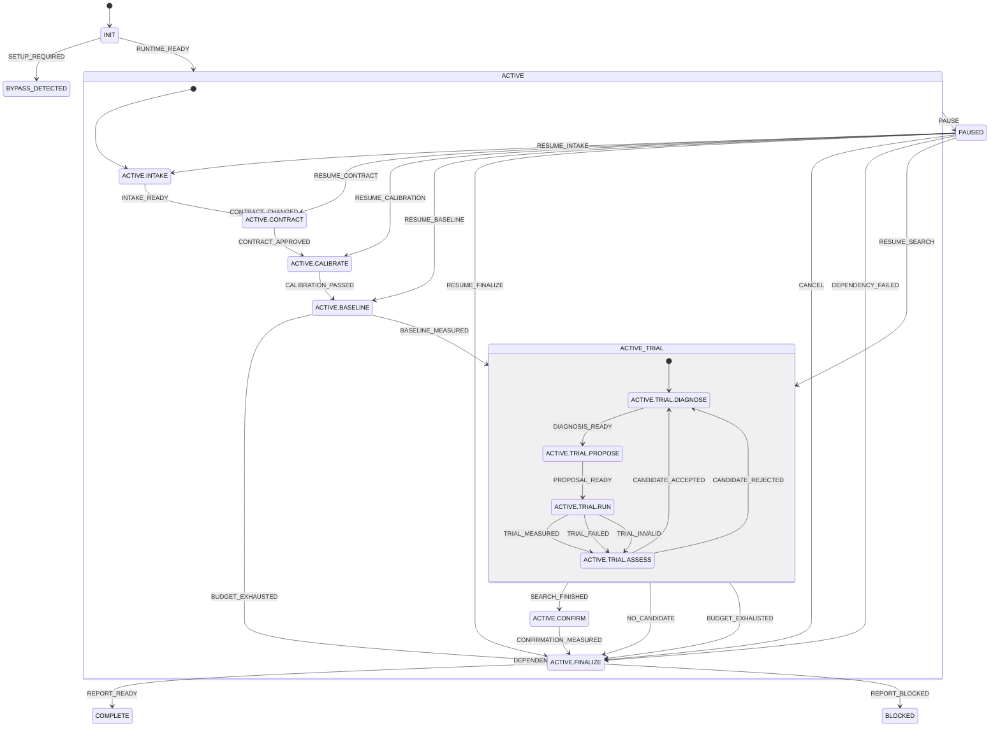

# Experiment loop statechart

The manifest is authoritative.
Composite handlers bubble from their nested leaves.
Every arrow has a deterministic guard in guards/; policy.cjs owns the shared predicates.

