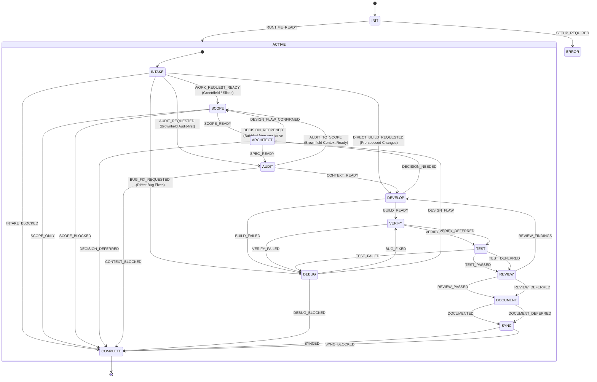

# ⚡ JSM Workflow

> Event-driven Reactive SDLC coordinator implementing the **Engineering Workflow** for autonomous and pair-programming AI coding agents.

[](https://jsmastery.com/skills)
[](#architecture)
[](LICENSE)

---

## 📖 Attribution & Provenance

This skill is an event-driven Reactive Skill state machine implementation based directly on the **Engineering Workflow Skills** created by **[Adrian Hajdin / JS Mastery](https://jsmastery.com/skills)** ([GitHub Repository](https://github.com/jsmastery-pro/skills)).

It unifies the nine discrete JSM workflow skills (`scope`, `audit`, `architect`, `develop`, `check`, `test`, `debug`, `document`, `sync`) into an orchestrating state machine with deterministic transitions, atomic quality gates, and automated artifact projection, while strictly maintaining the core principles of the JSM workflow:
- **Asks vs Acts**: The agent never silently assumes load-bearing architectural decisions or delivery preferences.
- **Input Coverage Test**: Every value the build produces must have a named source in the spec; ungrounded values stop the build.
- **Acceptance Criteria Thread**: Requirements trace in a straight line from `/architect` specs to `/develop` check steps, `/verify` live app proof, and `/test` suites.
- **Workflow Tiers**: `Prototype`, `Alpha`, `Beta`, and `GA` dynamically configure the post-build verification and testing tail.
- **Cross-Model Review**: Code reviews are run with fresh eyes on a secondary model to eliminate self-confirmation bias.
- **Surgical Sync**: Reconciles durable context and spec status from git evidence without rewriting user prose.

---

## 🗺️ Statechart Overview



---

## 🚦 Lifecycle Phases

| Phase | Purpose | Output / Artifact |
| :--- | :--- | :--- |
| **Intake** | Captures request, checks repo state, routes to appropriate lifecycle track. | `.docs/jsm-workflow/<run_id>/intake.md` |
| **Scope** | Turns vague idea into ordered slices, acceptance seeds, and workflow tier. | `docs/scope/` |
| **Architect** | Resolves load-bearing decisions via interactive interview and writes build spec. | `docs/specs/NNNN-<slug>.md` (Proposed) |
| **Audit** | Establishes durable context files describing stack, commands, and conventions. | `AGENTS.md` (+ `CLAUDE.md` pointer) |
| **Develop** | Implements feature from spec, enforces input-coverage, and moves spec status. | Source code, `design.md`, (In Progress) |
| **Verify** | Proves behavior in the real running application against numbered criteria. | `verify.md`, live test results |
| **Test** | Writes or updates automated unit/integration tests to lock in proof. | Test suites, spec &rarr; `Accepted` |
| **Debug** | Reproduces failure, isolates root cause, minimal fix, hands regression test. | Minimal fix, rerun evidence |
| **Review** | Fresh-eyes review on a second model; worst-first severity ranking. | `docs/reviews/`, diff critique |
| **Document** | Writes human-facing changelogs, release notes, or PR bodies from the real diff. | `CHANGELOG.md`, `docs/releases/` |
| **Sync** | Surgically reconciles `AGENTS.md`, scope status, and flags stale specs. | Surgical updates |

---

## 🚀 Quick Start

### 1. Execution via Reactive Skills CLI
```bash
# Check current state prompt
reactive-skills-axi state jsm-workflow

# Advance workflow by emitting a signal
reactive-skills-axi emit jsm-workflow <SIGNAL>
```

### 2. Execution via Model Context Protocol (MCP)
Use `reactive_state` to inspect the current state prompt and `reactive_emit_signal` to transition between states.

---

## 📁 Artifacts & Projections

All run metadata is automatically projected to `.docs/jsm-workflow/<run_id>/`:
- `intake.md`: Work request, target area, desired outcome, constraints, blockers.
- `lifecycle.md`: End-to-end scope, decision, context, build, and sync summary.
- `adr.md`: Architecture decision record when a load-bearing decision was settled.
- `verification.md`: Real behavior checks and acceptance criteria evidence.
- `review.md`: Code review findings, missing tests, and residual risk.
- `handoff.md`: Final completion summary, changed files, and recommended next actions.

---

## 📜 References & Acknowledgements

- **JS Mastery Engineering Workflow**: https://jsmastery.com/skills
- **JS Mastery Skills Repository**: https://github.com/jsmastery-pro/skills
- **Agent Skills Open Specification**: https://agentskills.io
