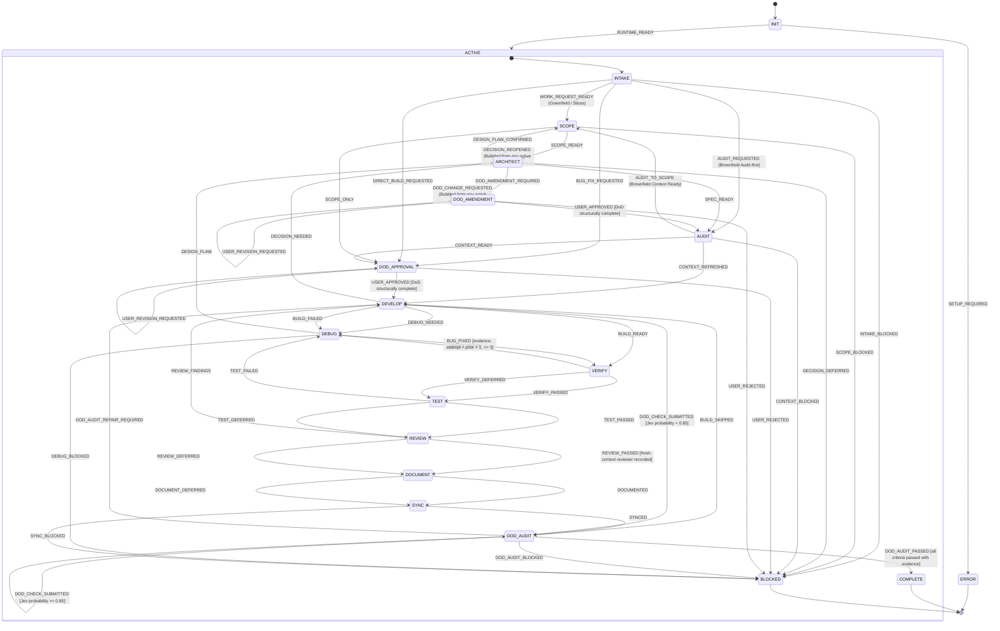

# ⚡ JSM Workflow

> Event-driven Reactive SDLC coordinator implementing the **Engineering Workflow** for autonomous and pair-programming AI coding agents.

[](https://jsmastery.com/skills)
[](#architecture)
[](LICENSE)

---

## 📖 Attribution & Provenance

This skill is an event-driven Reactive Skill state machine implementation based directly on the **Engineering Workflow Skills** created by **[Adrian Hajdin / JS Mastery](https://jsmastery.com/skills)** ([GitHub Repository](https://github.com/jsmastery-pro/skills)).

It unifies the nine discrete JSM workflow skills (`scope`, `audit`, `architect`, `develop`, `check`, `test`, `debug`, `document`, `sync`) into an orchestrating state machine with deterministic transitions, atomic quality gates, and automated artifact projection, while strictly maintaining the core principles of the JSM workflow:
- **Asks vs Acts**: The agent records recommendations in one DoD card and asks only for user-only facts or a changed accepted decision.
- **Input Coverage Test**: Every value the build produces must have a named source in the spec; ungrounded values stop the build.
- **Acceptance Criteria Thread**: Requirements trace from the approved DoD through `/develop`, `/verify`, `/test`, and final evidence.
- **Workflow Tiers**: `Prototype`, `Alpha`, `Beta`, and `GA` dynamically configure the post-build verification and testing tail.
- **Cross-Model Review**: Code reviews run in a fresh subagent that never saw the build work, on a secondary model when available, to eliminate self-confirmation bias.
- **Capped Repair Loop**: Each failure gets three repair attempts, each fed the exact failing command and error line, before the run blocks.
- **Surgical Sync**: Reconciles durable context and spec status from git evidence without rewriting user prose.

## DoD and Approval Contract

The workflow presents one concise Definition of Done before implementation.
The approval card names the outcome, deliverables and locations, setup and use, itemized checks and evidence, assumptions, gotchas, exclusions, decisions, and planned external actions.
Exact checks run deterministically; Jev judges semantic checks at a 0.85 probability threshold, with each question tied to one criterion ID.
The runtime scores a Jev probability `p` as confidence `|2p - 1|`, so `skill.yaml` declares `min_confidence: 0.70`, which is exactly `p >= 0.85`.
The runtime refuses `USER_APPROVED` unless the DoD has an outcome and every criterion has a unique ID, question, expected result, `exact` or `semantic` check type, and evidence method.
Failed criteria return to the agent with the unsupported assertions and evidence, then route through repair and re-check.
The workflow asks for another approval only for a focused DoD diff after an accepted outcome or load-bearing decision changes.

---

## 🗺️ Statechart Overview


```mermaid
stateDiagram-v2
    [*] --> INIT
    INIT --> ACTIVE : RUNTIME_READY
    INIT --> ERROR : SETUP_REQUIRED

    state ACTIVE {
        [*] --> INTAKE
        INTAKE --> SCOPE : WORK_REQUEST_READY (Greenfield / Slices)
        INTAKE --> DOD_APPROVAL : BUG_FIX_REQUESTED
        INTAKE --> AUDIT : AUDIT_REQUESTED (Brownfield Audit-first)
        INTAKE --> DOD_APPROVAL : DIRECT_BUILD_REQUESTED
        INTAKE --> BLOCKED : INTAKE_BLOCKED
        SCOPE --> ARCHITECT : SCOPE_READY
        SCOPE --> DOD_APPROVAL : SCOPE_ONLY
        SCOPE --> BLOCKED : SCOPE_BLOCKED
        ARCHITECT --> AUDIT : SPEC_READY
        ARCHITECT --> DOD_AMENDMENT : DOD_AMENDMENT_REQUIRED
        ARCHITECT --> BLOCKED : DECISION_DEFERRED
        ARCHITECT --> SCOPE : DESIGN_FLAW_CONFIRMED
        AUDIT --> DOD_APPROVAL : CONTEXT_READY
        AUDIT --> DEVELOP : CONTEXT_REFRESHED
        AUDIT --> SCOPE : AUDIT_TO_SCOPE (Brownfield Context Ready)
        AUDIT --> BLOCKED : CONTEXT_BLOCKED
        DOD_APPROVAL --> DEVELOP : USER_APPROVED [DoD structurally complete]
        DOD_APPROVAL --> DOD_APPROVAL : USER_REVISION_REQUESTED
        DOD_APPROVAL --> BLOCKED : USER_REJECTED
        DOD_AMENDMENT --> AUDIT : USER_APPROVED [DoD structurally complete]
        DOD_AMENDMENT --> DOD_AMENDMENT : USER_REVISION_REQUESTED
        DOD_AMENDMENT --> BLOCKED : USER_REJECTED
        DOD_AUDIT --> DOD_AUDIT : DOD_CHECK_SUBMITTED [Jev probability >= 0.85]
        DOD_AUDIT --> DEVELOP : DOD_CHECK_SUBMITTED [Jev probability < 0.85]
        DOD_AUDIT --> COMPLETE : DOD_AUDIT_PASSED [all criteria passed with evidence]
        DOD_AUDIT --> DEVELOP : DOD_AUDIT_REPAIR_REQUIRED
        DOD_AUDIT --> BLOCKED : DOD_AUDIT_BLOCKED
        DEVELOP --> DEBUG : DEBUG_NEEDED
        DEVELOP --> DOD_AUDIT : BUILD_SKIPPED
        DEVELOP --> VERIFY : BUILD_READY
        DEVELOP --> ARCHITECT : DECISION_NEEDED
        DEVELOP --> DEBUG : BUILD_FAILED
        VERIFY --> TEST : VERIFY_PASSED
        VERIFY --> DEBUG : VERIFY_FAILED
        VERIFY --> TEST : VERIFY_DEFERRED
        TEST --> REVIEW : TEST_PASSED
        TEST --> DEBUG : TEST_FAILED
        TEST --> REVIEW : TEST_DEFERRED
        DEBUG --> VERIFY : BUG_FIXED [evidence, attempt = prior + 1, <= 3]
        DEBUG --> ARCHITECT : DESIGN_FLAW
        DEBUG --> BLOCKED : DEBUG_BLOCKED
        REVIEW --> DOCUMENT : REVIEW_PASSED [fresh-context reviewer recorded]
        REVIEW --> DEVELOP : REVIEW_FINDINGS
        REVIEW --> DOCUMENT : REVIEW_DEFERRED
        DOCUMENT --> SYNC : DOCUMENTED
        DOCUMENT --> SYNC : DOCUMENT_DEFERRED
        SYNC --> DOD_AUDIT : SYNCED
        SYNC --> BLOCKED : SYNC_BLOCKED
    }

    ACTIVE --> ARCHITECT : DECISION_REOPENED (Bubbled from any active phase)
    ACTIVE --> DOD_AMENDMENT : DOD_CHANGE_REQUESTED (Bubbled from any active phase)
    COMPLETE --> [*]
    BLOCKED --> [*]
    ERROR --> [*]
    state BYPASS_DETECTED
```

---

## 🚦 Lifecycle Phases

| Phase | Purpose | Output / Artifact |
| :--- | :--- | :--- |
| **Intake** | Captures request, checks repo state, routes to appropriate lifecycle track. | `.docs/jsm-workflow/<run_id>/intake.md` |
| **Scope** | Turns vague idea into ordered slices, acceptance seeds, and workflow tier. | `docs/scope/` |
| **Architect** | Resolves load-bearing decisions via interactive interview and writes build spec. | `docs/specs/NNNN-<slug>.md` (Proposed) |
| **Audit** | Establishes durable context files describing stack, commands, and conventions. | `AGENTS.md` (+ `CLAUDE.md` pointer) |
| **DoD Approval** | Presents final output, setup, acceptance evidence, assumptions, and decisions for one approval. | `.docs/jsm-workflow/<run_id>/dod.md` |
| **Develop** | Implements feature from spec, enforces input-coverage, and moves spec status. | Source code, `design.md`, (In Progress) |
| **Verify** | Proves behavior in the real running application against numbered criteria. | `verify.md`, live test results |
| **Test** | Writes or updates automated unit/integration tests to lock in proof. | Test suites, spec &rarr; `Accepted` |
| **Debug** | Reproduces failure, isolates root cause, minimal fix, hands regression test. | Minimal fix, rerun evidence |
| **Review** | Fresh-eyes review on a second model; worst-first severity ranking. | `docs/reviews/`, diff critique |
| **Document** | Writes human-facing changelogs, release notes, or PR bodies from the real diff. | `CHANGELOG.md`, `docs/releases/` |
| **Sync** | Surgically reconciles `AGENTS.md`, scope status, and flags stale specs. | Surgical updates |

---

## 🚀 Quick Start

### Installation

Install `jsm-workflow` directly into your agent environment using `npx skills`:

```bash
npx skills add Reactive-Skills/skills --skill jsm-workflow
```

### 1. Execution via Reactive Skills CLI
```bash
# Check current state prompt
reactive-skills-axi state jsm-workflow

# Advance workflow by emitting a signal
reactive-skills-axi emit jsm-workflow <SIGNAL>
```

### 2. Execution via Model Context Protocol (MCP)
Use `reactive_state` to inspect the current state prompt and `reactive_emit_signal` to transition between states.

---

## 📁 Artifacts & Projections

All run metadata is automatically projected to `.docs/jsm-workflow/<run_id>/`:
- `dod.md`: approved final output, setup, acceptance checks, evidence methods, and boundaries.
- `intake.md`: Work request, target area, desired outcome, constraints, blockers.
- `lifecycle.md`: End-to-end scope, decision, context, build, and sync summary.
- `adr.md`: Architecture decision record when a load-bearing decision was settled.
- `verification.md`: Real behavior checks and acceptance criteria evidence.
- `review.md`: Code review findings, missing tests, and residual risk.
- `handoff.md`: Final completion summary, changed files, and recommended next actions.

## Directory Layout

```text
jsm-workflow/
├── CONTEXT.md
├── README.md
├── SKILL.md
├── STATECHART.md
├── skill-release.json
├── skill.yaml
├── guards/
│   ├── dod-structure.cjs
│   └── workflow.test.cjs
├── states/
│   ├── architect.md
│   ├── audit.md
│   ├── blocked.md
│   ├── bypass_detected.md
│   ├── complete.md
│   ├── debug.md
│   ├── develop.md
│   ├── document.md
│   ├── dod_amendment.md
│   ├── dod_approval.md
│   ├── dod_audit.md
│   ├── error.md
│   ├── init.md
│   ├── intake.md
│   ├── review.md
│   ├── scope.md
│   ├── sync.md
│   ├── test.md
│   └── verify.md
└── templates/
    ├── adr.md.hbs
    ├── dod.md.hbs
    ├── handoff.md.hbs
    ├── intake.md.hbs
    ├── lifecycle.md.hbs
    ├── review.md.hbs
    └── verification.md.hbs
```

## Validate

```bash
node scripts/validate-skills.js jsm-workflow --no-runtime
node --test jsm-workflow/guards/workflow.test.cjs
```

The acceptance scenarios cover the bubbled `DOD_CHANGE_REQUESTED` and `DECISION_REOPENED` events, the Jev probability threshold at 0.84, 0.85, and 0.86, the completion guard, the structural DoD guard on both approval gates, the three-attempt repair cap, and the fresh-context review guard.
They stub the TypeSafe SDK that the runtime loads, so no Jev key or network is needed.
Bubbled events need a runtime that keeps run version checks valid during bubbling; Reactive Skills 0.16.0 rejects them with `RUN_VERSION_CONFLICT`.
To test a local runtime build, set `JSM_WORKFLOW_RUNTIME` to its absolute `dist/index.js` path before running the acceptance suite.

---

## 📜 References & Acknowledgements

- **JS Mastery Engineering Workflow**: https://jsmastery.com/skills
- **JS Mastery Skills Repository**: https://github.com/jsmastery-pro/skills
- **Agent Skills Open Specification**: https://agentskills.io
