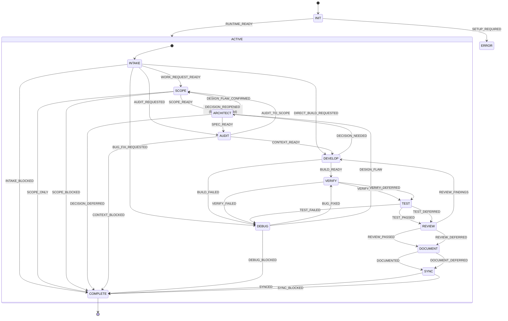

# Statechart: jsm-workflow

`ACTIVE` owns every nonterminal lifecycle phase after runtime initialization.
`DECISION_REOPENED` bubbles from any active child to the parent and routes to `ARCHITECT`.

