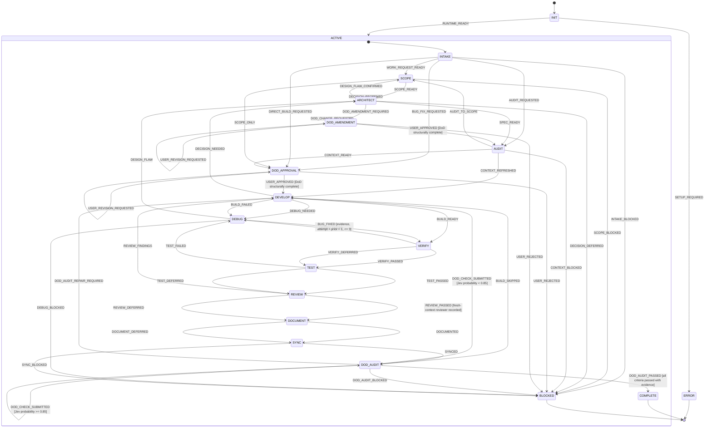

# Statechart: jsm-workflow

`ACTIVE` owns every nonterminal delivery phase after runtime initialization.
`DECISION_REOPENED` bubbles to `ACTIVE.ARCHITECT`.
`DOD_CHANGE_REQUESTED` bubbles to `ACTIVE.DOD_AMENDMENT`.
An approved amendment refreshes project context before implementation resumes.
The `DOD_CHECK_SUBMITTED` probability labels map to `min_probability: 0.85`.

```mermaid
stateDiagram-v2
    [*] --> INIT
    INIT --> ACTIVE : RUNTIME_READY
    INIT --> ERROR : SETUP_REQUIRED

    state ACTIVE {
        [*] --> INTAKE
        INTAKE --> SCOPE : WORK_REQUEST_READY
        INTAKE --> DOD_APPROVAL : BUG_FIX_REQUESTED
        INTAKE --> AUDIT : AUDIT_REQUESTED
        INTAKE --> DOD_APPROVAL : DIRECT_BUILD_REQUESTED
        INTAKE --> BLOCKED : INTAKE_BLOCKED
        SCOPE --> ARCHITECT : SCOPE_READY
        SCOPE --> DOD_APPROVAL : SCOPE_ONLY
        SCOPE --> BLOCKED : SCOPE_BLOCKED
        ARCHITECT --> AUDIT : SPEC_READY
        ARCHITECT --> DOD_AMENDMENT : DOD_AMENDMENT_REQUIRED
        ARCHITECT --> BLOCKED : DECISION_DEFERRED
        ARCHITECT --> SCOPE : DESIGN_FLAW_CONFIRMED
        AUDIT --> DOD_APPROVAL : CONTEXT_READY
        AUDIT --> DEVELOP : CONTEXT_REFRESHED
        AUDIT --> SCOPE : AUDIT_TO_SCOPE
        AUDIT --> BLOCKED : CONTEXT_BLOCKED
        DOD_APPROVAL --> DEVELOP : USER_APPROVED [DoD structurally complete]
        DOD_APPROVAL --> DOD_APPROVAL : USER_REVISION_REQUESTED
        DOD_APPROVAL --> BLOCKED : USER_REJECTED
        DOD_AMENDMENT --> AUDIT : USER_APPROVED [DoD structurally complete]
        DOD_AMENDMENT --> DOD_AMENDMENT : USER_REVISION_REQUESTED
        DOD_AMENDMENT --> BLOCKED : USER_REJECTED
        DOD_AUDIT --> DOD_AUDIT : DOD_CHECK_SUBMITTED [Jev probability >= 0.85]
        DOD_AUDIT --> DEVELOP : DOD_CHECK_SUBMITTED [Jev probability < 0.85]
        DOD_AUDIT --> COMPLETE : DOD_AUDIT_PASSED [all criteria passed with evidence]
        DOD_AUDIT --> DEVELOP : DOD_AUDIT_REPAIR_REQUIRED
        DOD_AUDIT --> BLOCKED : DOD_AUDIT_BLOCKED
        DEVELOP --> DEBUG : DEBUG_NEEDED
        DEVELOP --> DOD_AUDIT : BUILD_SKIPPED
        DEVELOP --> VERIFY : BUILD_READY
        DEVELOP --> ARCHITECT : DECISION_NEEDED
        DEVELOP --> DEBUG : BUILD_FAILED
        VERIFY --> TEST : VERIFY_PASSED
        VERIFY --> DEBUG : VERIFY_FAILED
        VERIFY --> TEST : VERIFY_DEFERRED
        TEST --> REVIEW : TEST_PASSED
        TEST --> DEBUG : TEST_FAILED
        TEST --> REVIEW : TEST_DEFERRED
        DEBUG --> VERIFY : BUG_FIXED [evidence, attempt = prior + 1, <= 3]
        DEBUG --> ARCHITECT : DESIGN_FLAW
        DEBUG --> BLOCKED : DEBUG_BLOCKED
        REVIEW --> DOCUMENT : REVIEW_PASSED [fresh-context reviewer recorded]
        REVIEW --> DEVELOP : REVIEW_FINDINGS
        REVIEW --> DOCUMENT : REVIEW_DEFERRED
        DOCUMENT --> SYNC : DOCUMENTED
        DOCUMENT --> SYNC : DOCUMENT_DEFERRED
        SYNC --> DOD_AUDIT : SYNCED
        SYNC --> BLOCKED : SYNC_BLOCKED
    }

    ACTIVE --> ARCHITECT : DECISION_REOPENED
    ACTIVE --> DOD_AMENDMENT : DOD_CHANGE_REQUESTED
    COMPLETE --> [*]
    BLOCKED --> [*]
    ERROR --> [*]
    state BYPASS_DETECTED
```
