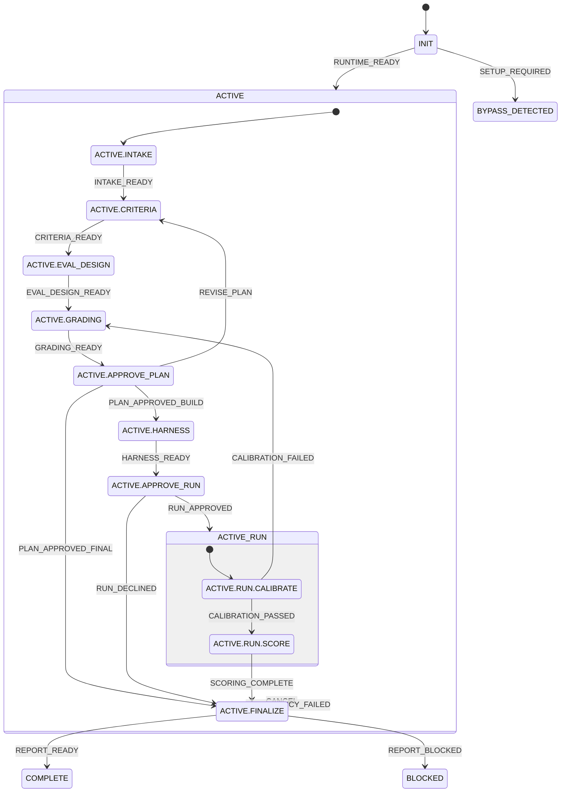

# LLM eval design statechart

The manifest is authoritative.
Composite handlers bubble from their nested leaves.
Every arrow has a deterministic guard in guards/; policy.cjs owns the shared predicates.
The default path ends at APPROVE_PLAN with PLAN_APPROVED_FINAL.
HARNESS, APPROVE_RUN, and RUN are opt-in.
CALIBRATION_FAILED and REVISE_PLAN are the only loops, and both pass a human gate again.

