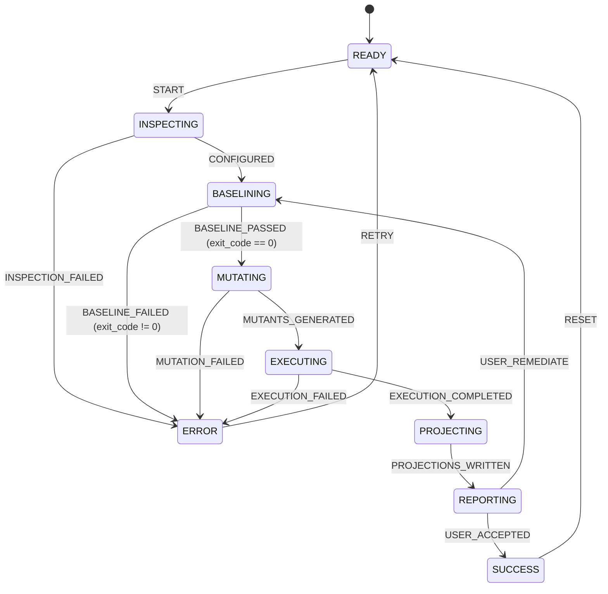

# Statechart: mutation-tester

```mermaid
stateDiagram-v2
    [*] --> READY

    READY --> INSPECTING: START
    INSPECTING --> BASELINING: CONFIGURED
    INSPECTING --> ERROR: INSPECTION_FAILED

    BASELINING --> MUTATING: BASELINE_PASSED (exit_code == 0)
    BASELINING --> ERROR: BASELINE_FAILED (exit_code != 0)

    MUTATING --> EXECUTING: MUTANTS_GENERATED
    MUTATING --> ERROR: MUTATION_FAILED

    EXECUTING --> PROJECTING: EXECUTION_COMPLETED
    EXECUTING --> ERROR: EXECUTION_FAILED

    PROJECTING --> REPORTING: PROJECTIONS_WRITTEN

    REPORTING --> SUCCESS: USER_ACCEPTED
    REPORTING --> BASELINING: USER_REMEDIATE

    SUCCESS --> READY: RESET
    ERROR --> READY: RETRY
```
