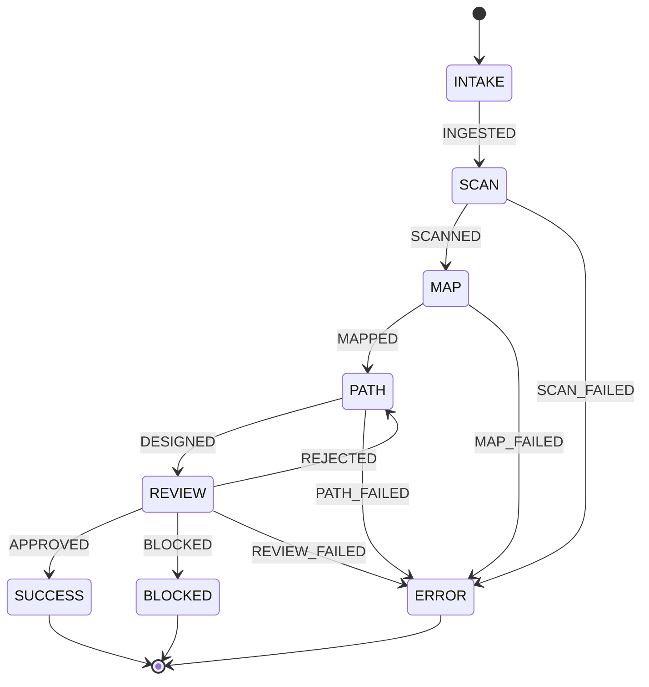

# STATECHART

## Transitions Summary

| Signal | Source | Target | Guard |
|--------|--------|--------|-------|
| `INGESTED` | INTAKE | SCAN | `repo_path != null && user_role != null` |
| `SCANNED` | SCAN | MAP | `module_count > 0` |
| `MAPPED` | MAP | PATH | `dependency_graph != null` |
| `DESIGN_PATH` | PATH | REVIEW | `learning_path != null` |
| `APPROVED` | REVIEW | SUCCESS | — |
| `REJECTED` | REVIEW | PATH | — |
| `BLOCKED` | REVIEW | BLOCKED | — |
| `SCAN_FAILED` | SCAN | ERROR | — |
| `MAP_FAILED` | MAP | ERROR | — |
| `PATH_FAILED` | PATH | ERROR | — |
| `REVIEW_FAILED` | REVIEW | ERROR | — |
