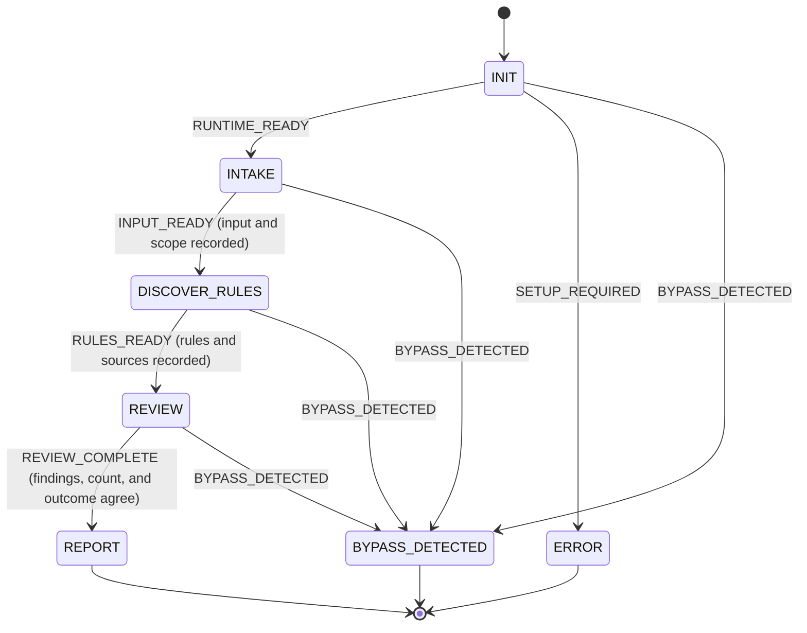

# Statechart

BYPASS_DETECTED is a runtime event that can leave any active work state.

```mermaid
stateDiagram-v2
    [*] --> INIT
    INIT --> INTAKE: RUNTIME_READY
    INIT --> ERROR: SETUP_REQUIRED
    INIT --> BYPASS_DETECTED: BYPASS_DETECTED
    INTAKE --> DISCOVER_RULES: INPUT_READY (input and scope recorded)
    INTAKE --> BYPASS_DETECTED: BYPASS_DETECTED
    DISCOVER_RULES --> REVIEW: RULES_READY (rules and sources recorded)
    DISCOVER_RULES --> BYPASS_DETECTED: BYPASS_DETECTED
    REVIEW --> REPORT: REVIEW_COMPLETE (findings, count, and outcome agree)
    REVIEW --> BYPASS_DETECTED: BYPASS_DETECTED
    REPORT --> [*]
    BYPASS_DETECTED --> [*]
    ERROR --> [*]
```
