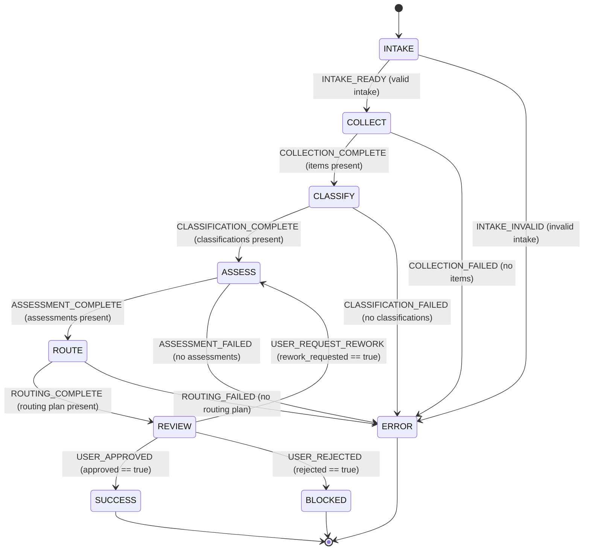

# PR Triage - Statechart

## Guard Reference

| From | Signal | To | Guard |
|---|---|---|---|
| `INTAKE` | `INTAKE_READY` | `COLLECT` | repository, PR batch, and policy are valid |
| `INTAKE` | `INTAKE_INVALID` | `ERROR` | required intake is missing |
| `COLLECT` | `COLLECTION_COMPLETE` | `CLASSIFY` | collected items are non-empty |
| `COLLECT` | `COLLECTION_FAILED` | `ERROR` | collected items are absent |
| `CLASSIFY` | `CLASSIFICATION_COMPLETE` | `ASSESS` | classifications are non-empty |
| `CLASSIFY` | `CLASSIFICATION_FAILED` | `ERROR` | classifications are absent |
| `ASSESS` | `ASSESSMENT_COMPLETE` | `ROUTE` | assessments are non-empty |
| `ASSESS` | `ASSESSMENT_FAILED` | `ERROR` | assessments are absent |
| `ROUTE` | `ROUTING_COMPLETE` | `REVIEW` | routing plan is non-empty |
| `ROUTE` | `ROUTING_FAILED` | `ERROR` | routing plan is absent |
| `REVIEW` | `USER_APPROVED` | `SUCCESS` | `payload.approved === true` |
| `REVIEW` | `USER_REQUEST_REWORK` | `ASSESS` | `payload.rework_requested === true` |
| `REVIEW` | `USER_REJECTED` | `BLOCKED` | `payload.rejected === true` |

`SUCCESS`, `BLOCKED`, and `ERROR` are terminal states.
