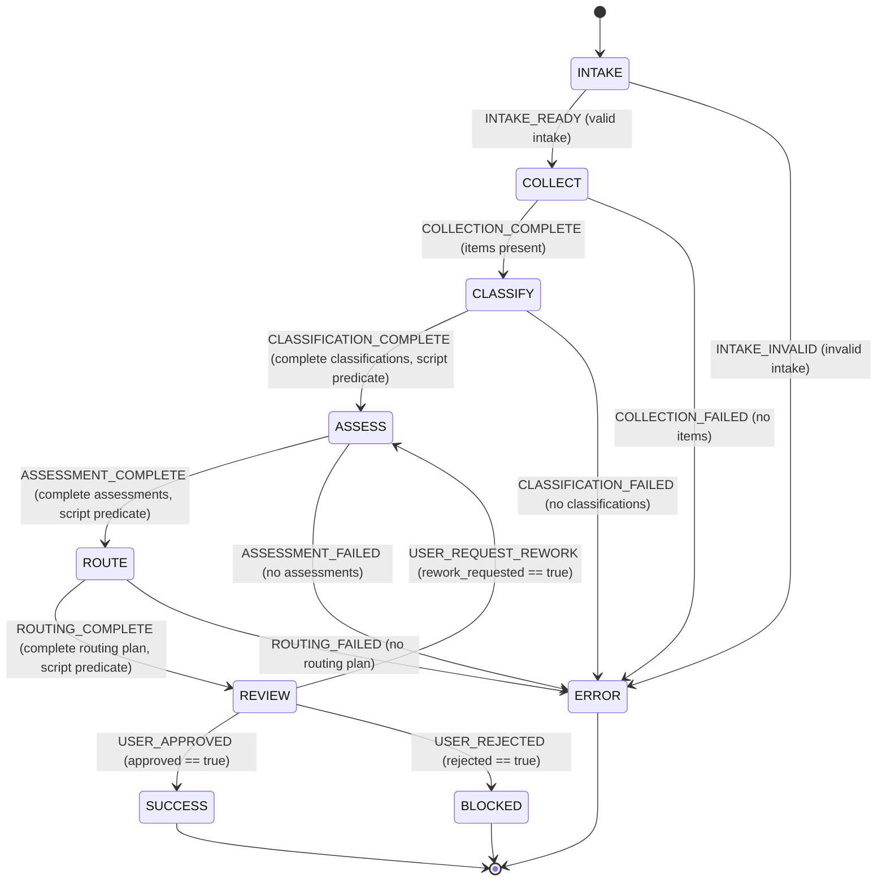

# PR Triage - Statechart

```mermaid
stateDiagram-v2
    [*] --> INTAKE
    INTAKE --> COLLECT: INTAKE_READY (valid intake)
    INTAKE --> ERROR: INTAKE_INVALID (invalid intake)
    COLLECT --> CLASSIFY: COLLECTION_COMPLETE (items present)
    COLLECT --> ERROR: COLLECTION_FAILED (no items)
    CLASSIFY --> ASSESS: CLASSIFICATION_COMPLETE (complete classifications, script predicate)
    CLASSIFY --> ERROR: CLASSIFICATION_FAILED (no classifications)
    ASSESS --> ROUTE: ASSESSMENT_COMPLETE (complete assessments, script predicate)
    ASSESS --> ERROR: ASSESSMENT_FAILED (no assessments)
    ROUTE --> REVIEW: ROUTING_COMPLETE (complete routing plan, script predicate)
    ROUTE --> ERROR: ROUTING_FAILED (no routing plan)
    REVIEW --> SUCCESS: USER_APPROVED (approved == true)
    REVIEW --> ASSESS: USER_REQUEST_REWORK (rework_requested == true)
    REVIEW --> BLOCKED: USER_REJECTED (rejected == true)
    SUCCESS --> [*]
    BLOCKED --> [*]
    ERROR --> [*]
```

## Guard Reference

| From | Signal | To | Guard |
|---|---|---|---|
| `INTAKE` | `INTAKE_READY` | `COLLECT` | repository, PR batch, and policy are valid |
| `INTAKE` | `INTAKE_INVALID` | `ERROR` | required intake is missing |
| `COLLECT` | `COLLECTION_COMPLETE` | `CLASSIFY` | collected items are non-empty |
| `COLLECT` | `COLLECTION_FAILED` | `ERROR` | collected items are absent |
| `CLASSIFY` | `CLASSIFICATION_COMPLETE` | `ASSESS` | Non-empty; each has risk, size, owner, reviewer classes, and evidence |
| `CLASSIFY` | `CLASSIFICATION_FAILED` | `ERROR` | classifications are absent |
| `ASSESS` | `ASSESSMENT_COMPLETE` | `ROUTE` | Non-empty; each has status and evidence |
| `ASSESS` | `ASSESSMENT_FAILED` | `ERROR` | assessments are absent |
| `ROUTE` | `ROUTING_COMPLETE` | `REVIEW` | Non-empty; each has a route, required actions, and evidence |
| `ROUTE` | `ROUTING_FAILED` | `ERROR` | routing plan is absent |
| `REVIEW` | `USER_APPROVED` | `SUCCESS` | `payload.approved === true` |
| `REVIEW` | `USER_REQUEST_REWORK` | `ASSESS` | `payload.rework_requested === true` |
| `REVIEW` | `USER_REJECTED` | `BLOCKED` | `payload.rejected === true` |

`SUCCESS`, `BLOCKED`, and `ERROR` are terminal states.

The three `*_COMPLETE` predicates use AXI's script adapter; their existing outer guards and failure transitions remain unchanged.
