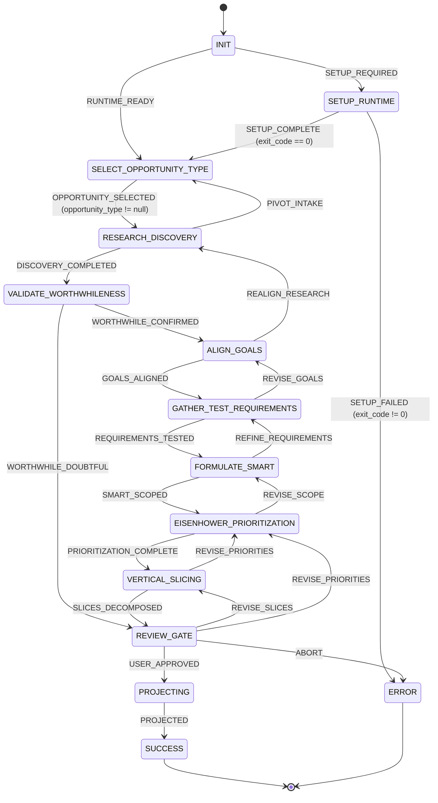

# product-manager — Statechart

Visual representation and transition specifications for the `product-manager` state machine.

---

## State Diagram

---

## States & Transitions Reference

| State | Signal | Target | Guard | Description |
|---|---|---|---|---|
| `INIT` | `RUNTIME_READY` | `SELECT_OPPORTUNITY_TYPE` | — | Runtime harness verified |
| `INIT` | `SETUP_REQUIRED` | `SETUP_RUNTIME` | — | Auto-configuration required |
| `SETUP_RUNTIME` | `SETUP_COMPLETE` | `SELECT_OPPORTUNITY_TYPE` | `payload.exit_code == 0` | Harness auto-configured |
| `SETUP_RUNTIME` | `SETUP_FAILED` | `ERROR` | `payload.exit_code != 0` | Auto-configuration failed |
| `SELECT_OPPORTUNITY_TYPE` | `OPPORTUNITY_SELECTED` | `RESEARCH_DISCOVERY` | `context.opportunity_type != null` | Opportunity mode chosen |
| `RESEARCH_DISCOVERY` | `DISCOVERY_COMPLETED` | `VALIDATE_WORTHWHILENESS` | — | Market/user evidence gathered |
| `RESEARCH_DISCOVERY` | `PIVOT_INTAKE` | `SELECT_OPPORTUNITY_TYPE` | — | Re-evaluate product classification |
| `VALIDATE_WORTHWHILENESS` | `WORTHWHILE_CONFIRMED` | `ALIGN_GOALS` | — | Opportunity passes 4-axis test |
| `VALIDATE_WORTHWHILENESS` | `WORTHWHILE_DOUBTFUL` | `REVIEW_GATE` | — | Low viability triggers human gate |
| `ALIGN_GOALS` | `GOALS_ALIGNED` | `GATHER_TEST_REQUIREMENTS` | — | Goals, OKRs & anti-goals defined |
| `ALIGN_GOALS` | `REALIGN_RESEARCH` | `RESEARCH_DISCOVERY` | — | Strategic misalignment triggers research revisit |
| `GATHER_TEST_REQUIREMENTS` | `REQUIREMENTS_TESTED` | `FORMULATE_SMART` | — | Falsification tests passed |
| `GATHER_TEST_REQUIREMENTS` | `REVISE_GOALS` | `ALIGN_GOALS` | — | Requirements suggest different goals |
| `FORMULATE_SMART` | `SMART_SCOPED` | `EISENHOWER_PRIORITIZATION` | — | SMART criteria formulated |
| `FORMULATE_SMART` | `REFINE_REQUIREMENTS` | `GATHER_TEST_REQUIREMENTS` | — | Unresolved ambiguities found |
| `EISENHOWER_PRIORITIZATION` | `PRIORITIZATION_COMPLETE` | `VERTICAL_SLICING` | — | Scope sorted into Q1–Q4 |
| `EISENHOWER_PRIORITIZATION` | `REVISE_SCOPE` | `FORMULATE_SMART` | — | Scope adjustments requested |
| `VERTICAL_SLICING` | `SLICES_DECOMPOSED` | `REVIEW_GATE` | — | Vertical slices & MVP boundary defined |
| `VERTICAL_SLICING` | `REVISE_PRIORITIES` | `EISENHOWER_PRIORITIZATION` | — | Slice dependencies force reprioritization |
| `REVIEW_GATE` | `USER_APPROVED` | `PROJECTING` | — | Human approves specification |
| `REVIEW_GATE` | `REVISE_SLICES` | `VERTICAL_SLICING` | — | Human requests slice redesign |
| `REVIEW_GATE` | `REVISE_PRIORITIES` | `EISENHOWER_PRIORITIZATION` | — | Human requests priority reshuffle |
| `REVIEW_GATE` | `ABORT` | `ERROR` | — | Human cancels opportunity |
| `PROJECTING` | `PROJECTED` | `SUCCESS` | — | Specs and inventory written to disk |
| `SUCCESS` | — | `[*]` | — | Terminal success state |
| `ERROR` | — | `[*]` | — | Terminal error state |
