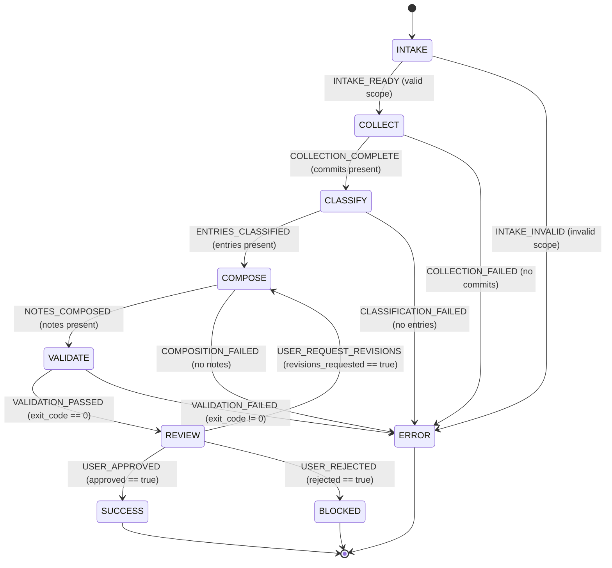

# Release Notes - Statechart

## Guard Reference

| From | Signal | To | Guard |
|---|---|---|---|
| `INTAKE` | `INTAKE_READY` | `COLLECT` | repository, version, and scope are valid |
| `INTAKE` | `INTAKE_INVALID` | `ERROR` | required intake is missing |
| `COLLECT` | `COLLECTION_COMPLETE` | `CLASSIFY` | commits are non-empty |
| `COLLECT` | `COLLECTION_FAILED` | `ERROR` | commits are absent |
| `CLASSIFY` | `ENTRIES_CLASSIFIED` | `COMPOSE` | changelog entries are non-empty |
| `CLASSIFY` | `CLASSIFICATION_FAILED` | `ERROR` | changelog entries are absent |
| `COMPOSE` | `NOTES_COMPOSED` | `VALIDATE` | release notes are non-empty |
| `COMPOSE` | `COMPOSITION_FAILED` | `ERROR` | release notes are absent |
| `VALIDATE` | `VALIDATION_PASSED` | `REVIEW` | `payload.exit_code === 0` |
| `VALIDATE` | `VALIDATION_FAILED` | `ERROR` | `payload.exit_code !== 0` |
| `REVIEW` | `USER_APPROVED` | `SUCCESS` | `payload.approved === true` |
| `REVIEW` | `USER_REQUEST_REVISIONS` | `COMPOSE` | `payload.revisions_requested === true` |
| `REVIEW` | `USER_REJECTED` | `BLOCKED` | `payload.rejected === true` |

`SUCCESS`, `BLOCKED`, and `ERROR` are terminal states.
