# Statechart

```mermaid
stateDiagram-v2
  [*] --> INIT
  INIT --> INTAKE: RUNTIME_READY
  INIT --> SETUP_RUNTIME: SETUP_REQUIRED
  SETUP_RUNTIME --> INIT: SETUP_COMPLETE
  SETUP_RUNTIME --> ERROR: SETUP_FAILED
  INTAKE --> DECISIONS: INTAKE_COMPLETE
  INTAKE --> CLARIFY: NEED_CLARIFICATION
  INTAKE --> SYNTHESIZE: EXISTING_PLAN_REVIEW
  CLARIFY --> DECISIONS: CLARIFIED
  CLARIFY --> FOUNDATIONS: ROUTE_FOUNDATIONS
  CLARIFY --> DECISIONS: ROUTE_APPROACH
  CLARIFY --> DECISIONS: ROUTE_QUANTITATIVE
  CLARIFY --> DECISIONS: ROUTE_QUALITATIVE
  CLARIFY --> DECISIONS: ROUTE_MIXED_METHODS
  CLARIFY --> PROPOSAL: ROUTE_PROPOSAL
  CLARIFY --> SYNTHESIZE: ROUTE_REVIEW
  CLARIFY --> DONE: USER_CANCELLED

  state DECISIONS {
    [*] --> ROUTE_TASK
    ROUTE_TASK --> DISPATCH: USER_CHOICE_SUBMITTED [route_task option]
    ROUTE_TASK --> DISPATCH: RECOMMENDATION_SUBMITTED [route_task option, confidence at least 0.7]
    CHOOSE_APPROACH --> DISPATCH: USER_CHOICE_SUBMITTED [approach option]
    CHOOSE_APPROACH --> DISPATCH: RECOMMENDATION_SUBMITTED [approach option, confidence at least 0.7]
    CHOOSE_QUANTITATIVE_DESIGN --> DISPATCH: USER_CHOICE_SUBMITTED [quantitative design option]
    CHOOSE_QUANTITATIVE_DESIGN --> DISPATCH: RECOMMENDATION_SUBMITTED [quantitative design option, confidence at least 0.7]
    CHOOSE_QUALITATIVE_STRATEGY --> DISPATCH: USER_CHOICE_SUBMITTED [qualitative strategy option]
    CHOOSE_QUALITATIVE_STRATEGY --> DISPATCH: RECOMMENDATION_SUBMITTED [qualitative strategy option, confidence at least 0.7]
    CHOOSE_MIXED_METHODS_DESIGN --> DISPATCH: USER_CHOICE_SUBMITTED [mixed methods design option]
    CHOOSE_MIXED_METHODS_DESIGN --> DISPATCH: RECOMMENDATION_SUBMITTED [mixed methods design option, confidence at least 0.7]
    DISPATCH --> CHOOSE_APPROACH: GO_APPROACH
    DISPATCH --> CHOOSE_QUANTITATIVE_DESIGN: GO_QUANTITATIVE
    DISPATCH --> CHOOSE_QUALITATIVE_STRATEGY: GO_QUALITATIVE
    DISPATCH --> CHOOSE_MIXED_METHODS_DESIGN: GO_MIXED_METHODS
  }

  state FOUNDATIONS {
    [*] --> TOPIC_AND_PROBLEM
    TOPIC_AND_PROBLEM --> LITERATURE_AND_THEORY: CONTINUE_TO_LITERATURE
    TOPIC_AND_PROBLEM --> WRITING_AND_ETHICS: CONTINUE_TO_ETHICS
    LITERATURE_AND_THEORY --> TOPIC_AND_PROBLEM: CONTINUE_TO_PROBLEM
    LITERATURE_AND_THEORY --> WRITING_AND_ETHICS: CONTINUE_TO_ETHICS
    WRITING_AND_ETHICS --> TOPIC_AND_PROBLEM: RETURN_TO_PROBLEM
  }

  state PROPOSAL {
    [*] --> SECTION_ROUTER
    SECTION_ROUTER --> INTRODUCTION: SECTION_INTRODUCTION
    SECTION_ROUTER --> PURPOSE_AND_AIM: SECTION_PURPOSE
    SECTION_ROUTER --> QUESTIONS_AND_HYPOTHESES: SECTION_QUESTIONS
    INTRODUCTION --> PURPOSE_AND_AIM: SECTION_PURPOSE
    INTRODUCTION --> QUESTIONS_AND_HYPOTHESES: SECTION_QUESTIONS
    PURPOSE_AND_AIM --> INTRODUCTION: SECTION_INTRODUCTION
    PURPOSE_AND_AIM --> QUESTIONS_AND_HYPOTHESES: SECTION_QUESTIONS
    QUESTIONS_AND_HYPOTHESES --> INTRODUCTION: SECTION_INTRODUCTION
    QUESTIONS_AND_HYPOTHESES --> PURPOSE_AND_AIM: SECTION_PURPOSE
  }

  state QUANTITATIVE {
    [*] --> SURVEY
    SURVEY --> ANALYSIS_PREREGISTRATION_VALIDITY: CONTINUE_TO_ANALYSIS
    EXPERIMENT --> ANALYSIS_PREREGISTRATION_VALIDITY: CONTINUE_TO_ANALYSIS
    ANALYSIS_PREREGISTRATION_VALIDITY --> SURVEY: RETURN_TO_SURVEY
    ANALYSIS_PREREGISTRATION_VALIDITY --> EXPERIMENT: RETURN_TO_EXPERIMENT
  }

  state QUALITATIVE {
    [*] --> ACCESS_SAMPLING_COLLECTION
    ACCESS_SAMPLING_COLLECTION --> ANALYSIS_VALIDATION_REPORTING: CONTINUE_TO_ANALYSIS
    ANALYSIS_VALIDATION_REPORTING --> ACCESS_SAMPLING_COLLECTION: RETURN_TO_COLLECTION
  }

  state MIXED_METHODS {
    [*] --> STRAND_PROCEDURES
    STRAND_PROCEDURES --> INTEGRATION_AND_INTERPRETATION: CONTINUE_TO_INTEGRATION
    INTEGRATION_AND_INTERPRETATION --> STRAND_PROCEDURES: RETURN_TO_STRANDS
  }

  DECISIONS --> DONE: USER_CANCELLED
  DECISIONS --> CLARIFY: NEED_CLARIFICATION
  DECISIONS --> CLARIFY: CHILD RECOMMENDATION_FALLBACK
  DECISIONS --> FOUNDATIONS: DISPATCH GO_FOUNDATIONS
  DECISIONS --> PROPOSAL: DISPATCH GO_PROPOSAL
  DECISIONS --> QUANTITATIVE: DISPATCH GO_SURVEY or GO_EXPERIMENT
  DECISIONS --> QUALITATIVE: DISPATCH GO_QUAL_STRATEGY
  DECISIONS --> MIXED_METHODS: DISPATCH GO_MIXED_DESIGN
  DECISIONS --> SYNTHESIZE: DISPATCH GO_REVIEW
  DECISIONS --> CLARIFY: DISPATCH GO_CLARIFY
  FOUNDATIONS --> DECISIONS: RETURN_TO_ROUTER
  FOUNDATIONS --> INTAKE: RETURN_TO_INTAKE
  FOUNDATIONS --> SYNTHESIZE: FINISH_SECTION
  FOUNDATIONS --> DECISIONS: LEAF SELECT_APPROACH
  FOUNDATIONS --> PROPOSAL: LEAF SELECT_PROPOSAL_SECTION
  FOUNDATIONS --> CLARIFY: LEAF ASK_CLARIFY
  FOUNDATIONS --> SYNTHESIZE: LEAF SYNTHESIZE
  PROPOSAL --> FOUNDATIONS: RETURN_TO_FOUNDATIONS
  PROPOSAL --> DECISIONS: RETURN_TO_ROUTER
  PROPOSAL --> SYNTHESIZE: FINISH_SECTION
  PROPOSAL --> FOUNDATIONS: SECTION_ROUTER SECTION_OTHER
  PROPOSAL --> CLARIFY: LEAF ASK_CLARIFY
  PROPOSAL --> SYNTHESIZE: LEAF SYNTHESIZE
  QUANTITATIVE --> DECISIONS: RETURN_TO_ROUTER
  QUANTITATIVE --> FOUNDATIONS: RETURN_TO_FOUNDATIONS
  QUANTITATIVE --> SYNTHESIZE: FINISH_DESIGN
  QUANTITATIVE --> CLARIFY: LEAF ASK_CLARIFY
  QUANTITATIVE --> SYNTHESIZE: LEAF SYNTHESIZE
  QUALITATIVE --> DECISIONS: RETURN_TO_ROUTER
  QUALITATIVE --> FOUNDATIONS: RETURN_TO_FOUNDATIONS
  QUALITATIVE --> SYNTHESIZE: FINISH_DESIGN
  QUALITATIVE --> CLARIFY: LEAF ASK_CLARIFY
  QUALITATIVE --> SYNTHESIZE: LEAF SYNTHESIZE
  MIXED_METHODS --> DECISIONS: RETURN_TO_ROUTER
  MIXED_METHODS --> FOUNDATIONS: RETURN_TO_FOUNDATIONS
  MIXED_METHODS --> SYNTHESIZE: FINISH_DESIGN
  MIXED_METHODS --> CLARIFY: LEAF ASK_CLARIFY
  MIXED_METHODS --> SYNTHESIZE: LEAF SYNTHESIZE

  SYNTHESIZE --> DONE: DELIVERED
  SYNTHESIZE --> CLARIFY: REFINE
  SYNTHESIZE --> DECISIONS: CONTINUE_DESIGN
  ERROR --> [*]
  BYPASS_DETECTED --> [*]
  DONE --> [*]
```

Composite parents own their shared return, clarification, and finish handlers.
Cross-composite leaf routes are summarized at parent level because Mermaid does not support direct transitions between children of different composite states.
The labels identify the originating child and event; `skill.yaml` remains authoritative for exact sources and nested destinations:

- Intake and clarification return to `DECISIONS.ROUTE_TASK`.
- Clarification may enter `DECISIONS.CHOOSE_APPROACH`, `DECISIONS.CHOOSE_QUANTITATIVE_DESIGN`, `DECISIONS.CHOOSE_QUALITATIVE_STRATEGY`, `DECISIONS.CHOOSE_MIXED_METHODS_DESIGN`, or `PROPOSAL.SECTION_ROUTER`.
- The decision dispatcher may enter `FOUNDATIONS.TOPIC_AND_PROBLEM`, `PROPOSAL.SECTION_ROUTER`, any declared decision child, `QUANTITATIVE.SURVEY`, `QUANTITATIVE.EXPERIMENT`, `QUALITATIVE.ACCESS_SAMPLING_COLLECTION`, or `MIXED_METHODS.STRAND_PROCEDURES`.
- Foundation states may enter `DECISIONS.CHOOSE_APPROACH` or `PROPOSAL.SECTION_ROUTER`.
- The proposal section router may enter `FOUNDATIONS.TOPIC_AND_PROBLEM`.
- Composite return handlers enter the initial child of their target composite.
