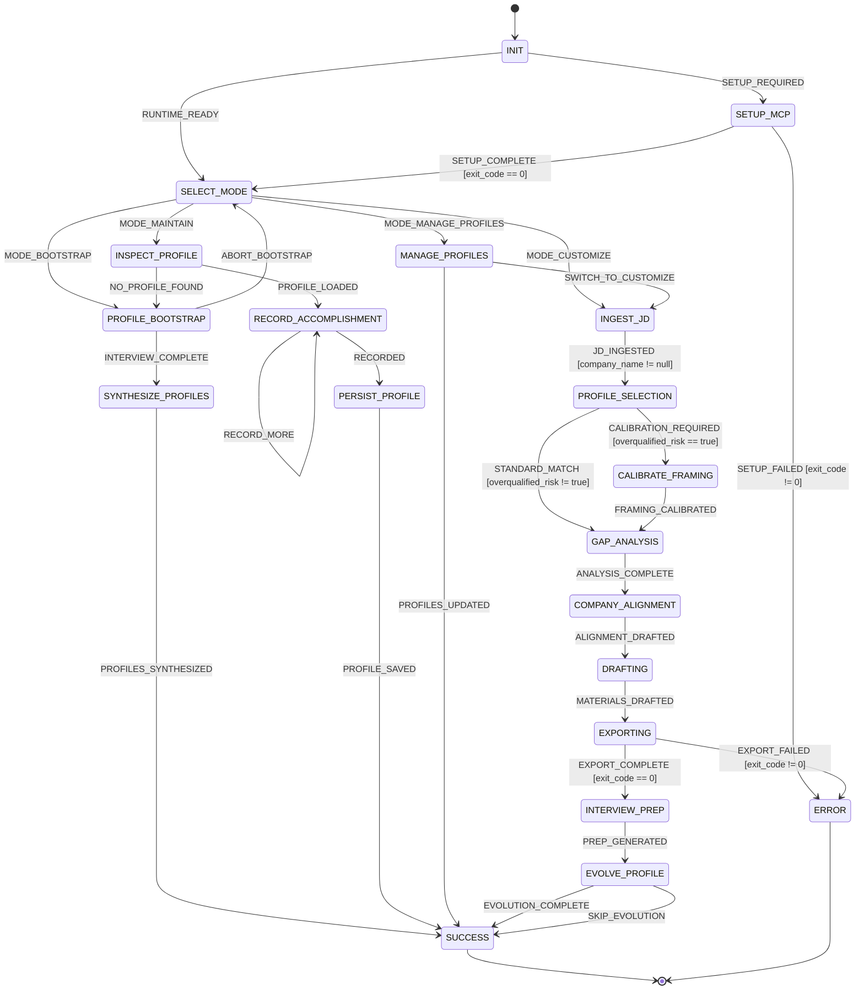

# Statechart: resume-manager

Hierarchical & Finite State Machine architecture for the `resume-manager` skill.

```mermaid
stateDiagram-v2
    [*] --> INIT

    INIT --> SELECT_MODE: RUNTIME_READY
    INIT --> SETUP_MCP: SETUP_REQUIRED

    SETUP_MCP --> SELECT_MODE: SETUP_COMPLETE [exit_code == 0]
    SETUP_MCP --> ERROR: SETUP_FAILED [exit_code != 0]

    state "SELECT_MODE" as SELECT_MODE
    SELECT_MODE --> INGEST_JD: MODE_CUSTOMIZE
    SELECT_MODE --> INSPECT_PROFILE: MODE_MAINTAIN
    SELECT_MODE --> PROFILE_BOOTSTRAP: MODE_BOOTSTRAP
    SELECT_MODE --> MANAGE_PROFILES: MODE_MANAGE_PROFILES

    %% Bootstrap Track
    state "PROFILE_BOOTSTRAP" as PROFILE_BOOTSTRAP
    PROFILE_BOOTSTRAP --> SYNTHESIZE_PROFILES: INTERVIEW_COMPLETE
    PROFILE_BOOTSTRAP --> SELECT_MODE: ABORT_BOOTSTRAP

    state "SYNTHESIZE_PROFILES" as SYNTHESIZE_PROFILES
    SYNTHESIZE_PROFILES --> SUCCESS: PROFILES_SYNTHESIZED

    %% Maintain Track
    state "INSPECT_PROFILE" as INSPECT_PROFILE
    INSPECT_PROFILE --> RECORD_ACCOMPLISHMENT: PROFILE_LOADED
    INSPECT_PROFILE --> PROFILE_BOOTSTRAP: NO_PROFILE_FOUND

    state "RECORD_ACCOMPLISHMENT" as RECORD_ACCOMPLISHMENT
    RECORD_ACCOMPLISHMENT --> PERSIST_PROFILE: RECORDED
    RECORD_ACCOMPLISHMENT --> RECORD_ACCOMPLISHMENT: RECORD_MORE

    state "PERSIST_PROFILE" as PERSIST_PROFILE
    PERSIST_PROFILE --> SUCCESS: PROFILE_SAVED

    %% Profile Track Management
    state "MANAGE_PROFILES" as MANAGE_PROFILES
    MANAGE_PROFILES --> SUCCESS: PROFILES_UPDATED
    MANAGE_PROFILES --> INGEST_JD: SWITCH_TO_CUSTOMIZE

    %% Customization Track
    state "INGEST_JD" as INGEST_JD
    INGEST_JD --> PROFILE_SELECTION: JD_INGESTED [company_name != null]

    state "PROFILE_SELECTION" as PROFILE_SELECTION
    PROFILE_SELECTION --> CALIBRATE_FRAMING: CALIBRATION_REQUIRED [overqualified_risk == true]
    PROFILE_SELECTION --> GAP_ANALYSIS: STANDARD_MATCH [overqualified_risk != true]

    state "CALIBRATE_FRAMING" as CALIBRATE_FRAMING
    CALIBRATE_FRAMING --> GAP_ANALYSIS: FRAMING_CALIBRATED

    state "GAP_ANALYSIS" as GAP_ANALYSIS
    GAP_ANALYSIS --> COMPANY_ALIGNMENT: ANALYSIS_COMPLETE

    state "COMPANY_ALIGNMENT" as COMPANY_ALIGNMENT
    COMPANY_ALIGNMENT --> DRAFTING: ALIGNMENT_DRAFTED

    state "DRAFTING" as DRAFTING
    DRAFTING --> EXPORTING: MATERIALS_DRAFTED

    state "EXPORTING" as EXPORTING
    EXPORTING --> INTERVIEW_PREP: EXPORT_COMPLETE [exit_code == 0]
    EXPORTING --> ERROR: EXPORT_FAILED [exit_code != 0]

    state "INTERVIEW_PREP" as INTERVIEW_PREP
    INTERVIEW_PREP --> EVOLVE_PROFILE: PREP_GENERATED

    state "EVOLVE_PROFILE" as EVOLVE_PROFILE
    EVOLVE_PROFILE --> SUCCESS: EVOLUTION_COMPLETE
    EVOLVE_PROFILE --> SUCCESS: SKIP_EVOLUTION

    state "SUCCESS" as SUCCESS
    state "ERROR" as ERROR

    SUCCESS --> [*]
    ERROR --> [*]
```
