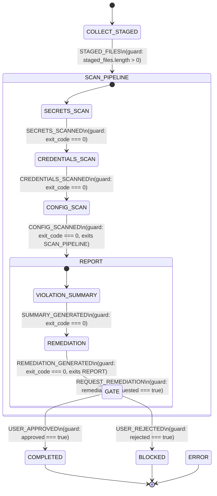

# STATECHART — security-scan



## Bubble-Up Transitions

1. **`CRITICAL_SECRET_FOUND`** (from any substate of SCAN_PIPELINE): Guards with `event.payload.severity === 'critical'`, transitions to `BLOCKED`. Catches security-critical secrets (e.g., AWS access keys, private keys with high entropy) without requiring each leaf scan to handle them.

2. **`REPORT_ERROR`** (from any substate of REPORT): Transitions to `ERROR` terminal state for unrecoverable report generation failures.

## Gate Semantics

The `GATE` state is the sole Human-in-the-Loop (HITL) checkpoint. The user can:
- **Pass (no critical issues)** → `COMPLETED` (guard: `approved === true`)
- **Request Remediation** → `SCAN_PIPELINE` (guard: `remediation_requested === true`) — re-runs all scans
- **Block Commit** → `BLOCKED` (guard: `rejected === true`) — halts with critical findings

## Scan Pipeline Flow

```
SECRETS_SCAN → CREDENTIALS_SCAN → CONFIG_SCAN
     |              |              |
     |              |              |
     └────────── All must pass (exit_code === 0) ───────────┘
                          ↓
                       REPORT
```

Each scan sub-state runs independently with deterministic guards. If any scan fails (exit_code !== 0), the transition is blocked and the scan must be retried. If a critical secret is found, the `CRITICAL_SECRET_FOUND` bubble-up event propagates to the parent `SCAN_PIPELINE` state, which transitions to `BLOCKED`.

## Event Sourcing

All signals, guard evaluations, and state transitions are appended to:
- `.reactive/skills/security-scan/events.jsonl` (human-readable)
- `.reactive/skills/security-scan/events.db` (SQLite queries)

Deliverable projections are triggered on `STATE_TRANSITION` and `SIGNAL_EMITTED` events, rendering from Handlebars templates in `templates/`.
