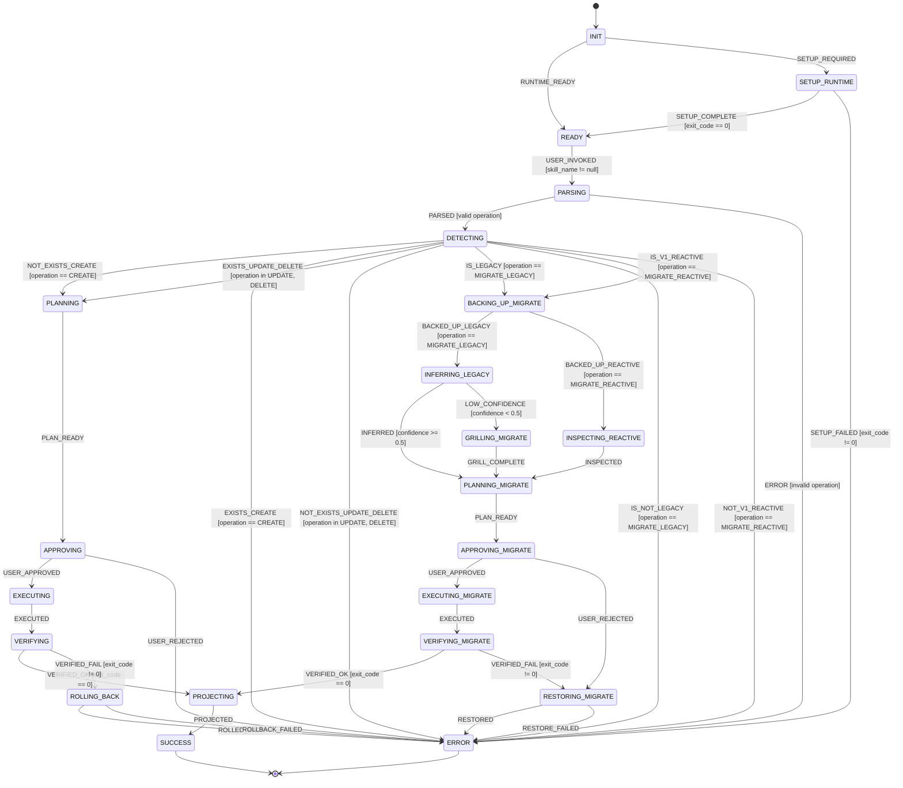

# Statechart: skill-manager

## State Machine Summary

| Phase | States | Description |
|-------|--------|-------------|
| **Bootloader** | `INIT`, `SETUP_RUNTIME`, `READY`, `PARSING` | Verifies the reactive runtime environment, sets up harness MCP tools if required, and parses the requested operation. |
| **Detection** | `DETECTING` | Checks workspace and user skill directories to determine whether the target exists, is legacy, or is v1 reactive. Routes to the appropriate branch or halts on constraint errors. |
| **CRUD Lifecycle** | `PLANNING`, `APPROVING`, `EXECUTING`, `VERIFYING`, `ROLLING_BACK` | Scaffolds (`CREATE`), modifies (`UPDATE`), or deletes (`DELETE`) skills with a mandatory human approval gate and automated rollback on verification failure. |
| **Migration Lifecycle** | `BACKING_UP_MIGRATE`, `INFERRING_LEGACY`, `GRILLING_MIGRATE`, `INSPECTING_REACTIVE`, `PLANNING_MIGRATE`, `APPROVING_MIGRATE`, `EXECUTING_MIGRATE`, `VERIFYING_MIGRATE`, `RESTORING_MIGRATE` | Creates an atomic backup, analyzes legacy `SKILL.md` or v1 `skill.yaml` structure (with Socratic grilling if confidence is $< 0.5$), executes migration, and restores from backup on failure. |
| **Delivery & Terminus** | `PROJECTING`, `SUCCESS`, `ERROR` | Renders the manifest snapshot and inventory projection templates before completing or reporting errors. |
