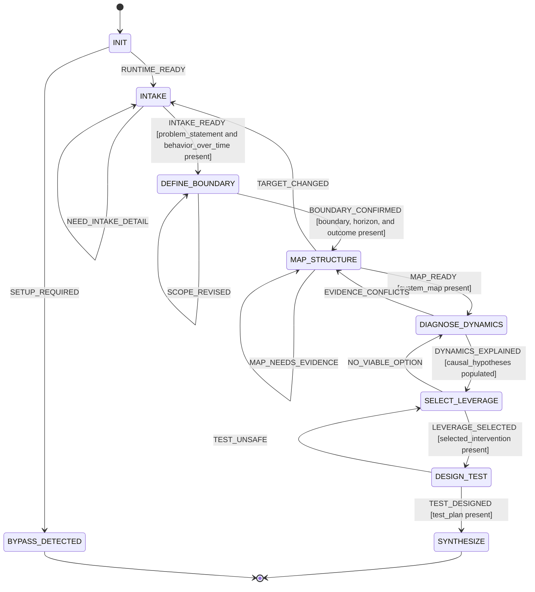

# Systems Diagnosis Statechart

## Guarded Transitions

- INTAKE_READY requires problem_statement and behavior_over_time.
- BOUNDARY_CONFIRMED requires system_boundary, time_horizon, and desired_outcome.
- MAP_READY requires system_map.
- DYNAMICS_EXPLAINED requires at least one causal hypothesis.
- LEVERAGE_SELECTED requires selected_intervention.
- TEST_DESIGNED requires test_plan.

## Revision Loops

- Missing intake evidence returns to INTAKE.
- Revised scope returns to DEFINE_BOUNDARY.
- Missing map evidence returns to MAP_STRUCTURE.
- Conflicting evidence returns to MAP_STRUCTURE.
- No viable intervention returns to DIAGNOSE_DYNAMICS.
- An unsafe test returns to SELECT_LEVERAGE.
