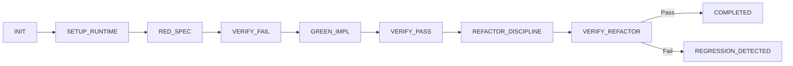

# 🧪 TDD Refactor

> Hierarchical TDD & Refactoring state machine with nested micro-cycles, regression detection, event bubbling, and live projections.

---

## Overview

`tdd-refactor` enforces the strict Red-Green-Refactor discipline as an event-driven reactive state machine. It prevents implementation without failing tests, prevents committing with broken suites, and ensures clean refactoring passes without behavioral regression.

## Workflow



## Quick Start

```bash
npx -y @reactive-skills/axi invoke tdd-refactor --payload '{
  "target_file": "src/service.ts",
  "test_file": "tests/service.test.ts"
}'
```
