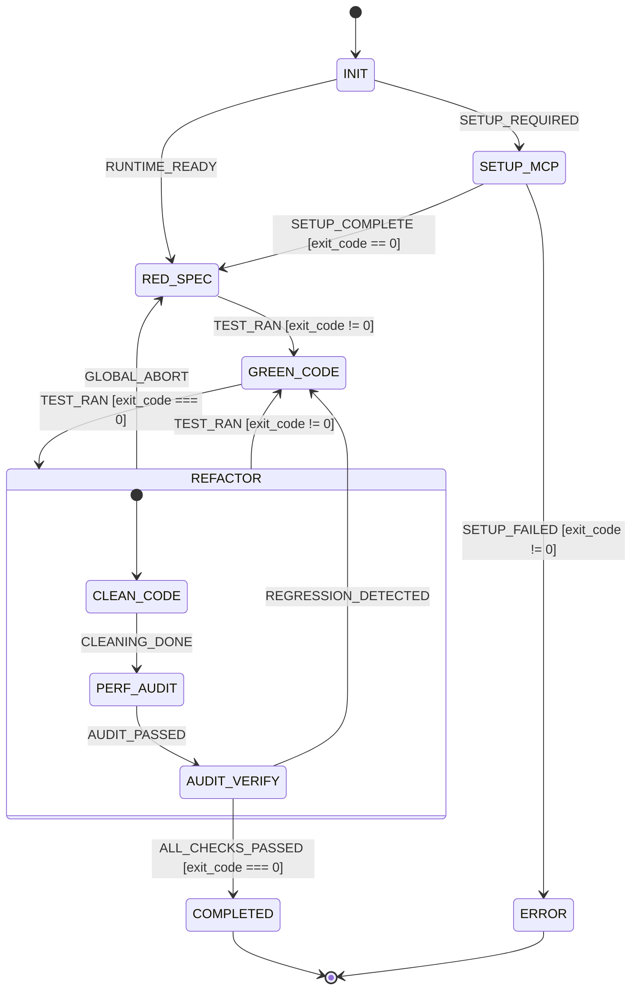

# Statechart: tdd-refactor

## Transitions Summary

| Signal | Source | Target | Guard |
|--------|--------|--------|-------|
| `RUNTIME_READY` | INIT | RED_SPEC | — |
| `SETUP_REQUIRED` | INIT | SETUP_MCP | — |
| `SETUP_COMPLETE` | SETUP_MCP | RED_SPEC | `payload.exit_code == 0` |
| `SETUP_FAILED` | SETUP_MCP | ERROR | `payload.exit_code != 0` |
| `TEST_RAN` | RED_SPEC | GREEN_CODE | `event.payload.exit_code != 0` |
| `TEST_RAN` | GREEN_CODE | REFACTOR | `event.payload.exit_code === 0` |
| `GLOBAL_ABORT` | REFACTOR | RED_SPEC | — |
| `TEST_RAN` | REFACTOR | GREEN_CODE | `event.payload.exit_code != 0` |
| `CLEANING_DONE` | REFACTOR.CLEAN_CODE | REFACTOR.PERF_AUDIT | — |
| `AUDIT_PASSED` | REFACTOR.PERF_AUDIT | AUDIT_VERIFY | — |
| `ALL_CHECKS_PASSED` | AUDIT_VERIFY | COMPLETED | `event.payload.exit_code === 0` |
| `REGRESSION_DETECTED` | AUDIT_VERIFY | GREEN_CODE | — |
| `DELIVERABLE_READY` | COMPLETED | terminal | on_enter emit |

## Composite State: REFACTOR

The `REFACTOR` state is a hierarchical composite state that manages the clean-code, performance-audit, and verification sub-phases. It increments `refactor_cycles` on entry, emits `REFACTOR_CYCLE_STARTED` on entry, and emits `REFACTOR_CYCLE_CONCLUDED` on exit.

| Substate | Description |
|----------|-------------|
| `CLEAN_CODE` | Simplify naming, remove duplication, extract deep helpers. Transitions to `PERF_AUDIT` on `CLEANING_DONE`. |
| `PERF_AUDIT` | Analyze complexity, eliminate unnecessary allocations and redundant I/O. Transitions to `AUDIT_VERIFY` on `AUDIT_PASSED`. |
| `AUDIT_VERIFY` | Run full verification suite, linter, and type checks. Transitions to `COMPLETED` on `ALL_CHECKS_PASSED` or back to `GREEN_CODE` on `REGRESSION_DETECTED`. |

The composite `REFACTOR` state also has external transitions: `GLOBAL_ABORT` exits to `RED_SPEC`, and `TEST_RAN` (with a failing guard) exits to `GREEN_CODE`.

`COMPLETED` and `ERROR` are terminal states.
