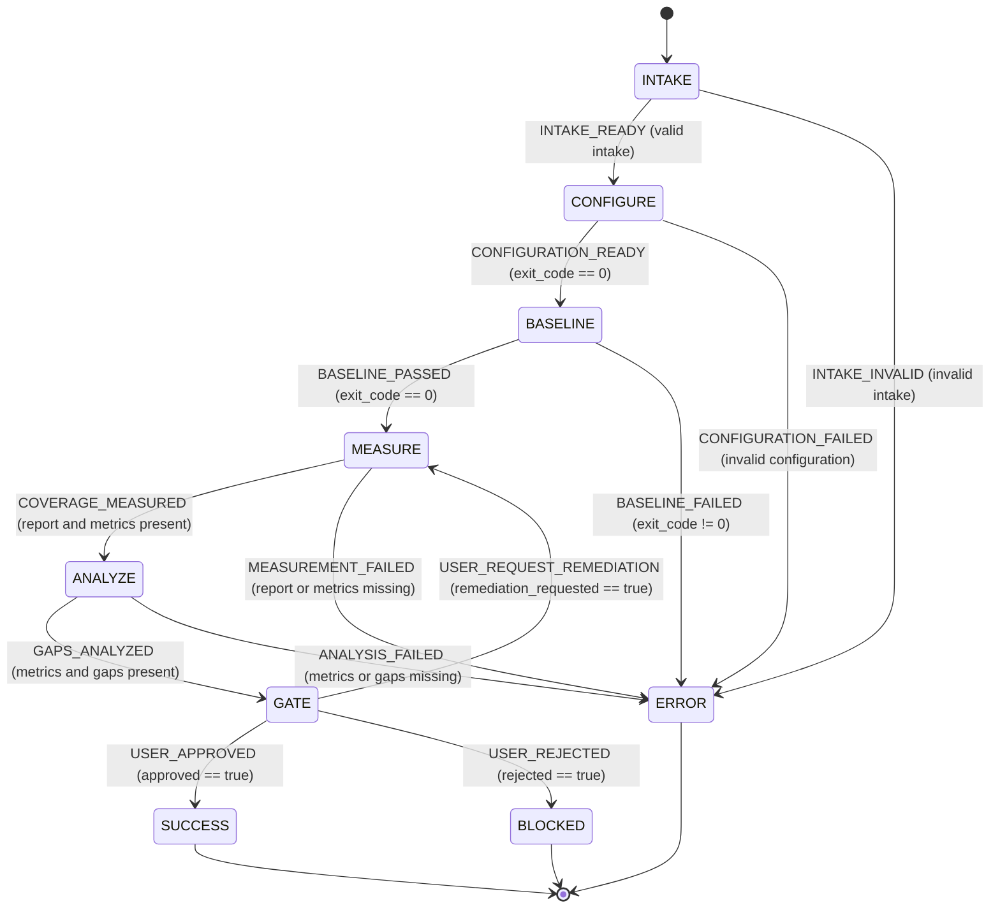

# Test Coverage Gate - Statechart

## Guard Reference

| From | Signal | To | Guard |
|---|---|---|---|
| `INTAKE` | `INTAKE_READY` | `CONFIGURE` | target, commands, and thresholds are present |
| `INTAKE` | `INTAKE_INVALID` | `ERROR` | required intake is missing |
| `CONFIGURE` | `CONFIGURATION_READY` | `BASELINE` | `payload.exit_code === 0` and thresholds exist |
| `CONFIGURE` | `CONFIGURATION_FAILED` | `ERROR` | configuration failed or thresholds are missing |
| `BASELINE` | `BASELINE_PASSED` | `MEASURE` | `payload.exit_code === 0` |
| `BASELINE` | `BASELINE_FAILED` | `ERROR` | `payload.exit_code !== 0` |
| `MEASURE` | `COVERAGE_MEASURED` | `ANALYZE` | report and metrics are present |
| `MEASURE` | `MEASUREMENT_FAILED` | `ERROR` | report or metrics are missing |
| `ANALYZE` | `GAPS_ANALYZED` | `GATE` | metrics and gap array are present |
| `ANALYZE` | `ANALYSIS_FAILED` | `ERROR` | metrics or gap array are missing |
| `GATE` | `USER_APPROVED` | `SUCCESS` | `payload.approved === true` |
| `GATE` | `USER_REQUEST_REMEDIATION` | `MEASURE` | `payload.remediation_requested === true` |
| `GATE` | `USER_REJECTED` | `BLOCKED` | `payload.rejected === true` |

`SUCCESS`, `BLOCKED`, and `ERROR` are terminal states.
